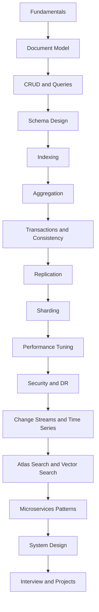
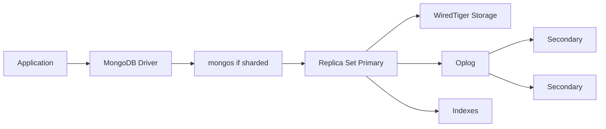

    # MongoDB Master Map and Use Cases - Hot Interview Master Sheet

    > **Track File #1 of 28 - Group 01: Starter Path**
    > For: backend/database/system design interviews | Level: beginner to interview-ready | Mode: mental models, database choice, use-case judgment

    This sheet builds:
    - MongoDB roadmap from fundamentals to system design
- What MongoDB is and why it exists
- MongoDB vs SQL, PostgreSQL, Redis, Elasticsearch, Cassandra, and DynamoDB
- When MongoDB is a strong or weak choice

Original master-map sections included here:
- 0. MongoDB Master Map
- 1. What Is MongoDB?

    How to use this:
    - Read the mental model first.
    - Practice the commands and examples in `mongosh` or a driver.
    - Say the interview answers out loud in 30-90 seconds.
    - Revisit the anti-patterns before designing production schemas.

    ---
## 0. MongoDB Master Map

MongoDB mastery is not just CRUD. The real skill is choosing the right document shape, indexing it correctly, understanding the operational behavior, and explaining tradeoffs under load and failure.

| Layer | What You Learn | Why It Matters |
|---|---|---|
| 1. Fundamentals | What MongoDB is, where it fits | Avoid using it for the wrong workload |
| 2. Document model | Documents, BSON, ObjectId, nested fields | Think in aggregates instead of tables |
| 3. CRUD | Insert, find, update, delete | Daily application development |
| 4. Schema design | Embed, reference, hybrid patterns | Most MongoDB performance comes from modeling |
| 5. Querying | Filters, operators, arrays, nested documents | Express reads clearly and efficiently |
| 6. Indexing | Index types, ESR, explain plans | Prevent collection scans and latency spikes |
| 7. Aggregation | Pipelines, joins, grouping, windows | Build reports, dashboards, transformations |
| 8. Transactions | Sessions, read/write concerns, ACID | Handle multi-document workflows safely |
| 9. Replication | Replica sets, elections, oplog | Availability and durability |
| 10. Sharding | Shard keys, chunks, mongos, balancer | Horizontal scale and global systems |
| 11. Performance tuning | Profiling, pagination, bulk writes | Keep production stable under traffic |
| 12. Security | Auth, roles, TLS, encryption, secrets | Protect data and reduce blast radius |
| 13. Backup/restore | Dumps, snapshots, PITR, RPO/RTO | Recover from data loss and outages |
| 14. Atlas/cloud | Managed operations, monitoring, search | Practical production deployment |
| 15. Change streams | Real-time events from database changes | Event-driven systems and cache invalidation |
| 16. Time-series | Metrics and event streams | Efficient telemetry storage |
| 17. Vector search / AI use cases | Embeddings, RAG, hybrid search | GenAI applications with operational metadata |
| 18. Production patterns | Outbox, CQRS, materialized views | Reliable systems, not just queries |
| 19. System design | Catalogs, chat, logs, feeds, SaaS | Interview and architecture readiness |
| 20. Interview prep | Questions, examples, tradeoffs | Communicate like a senior engineer |
| 21. Hands-on projects | Build, measure, fix | Convert knowledge into skill |

Mental model:

---

---

## 1. What Is MongoDB?

### One-Line Definition

MongoDB is a distributed document database that stores data as flexible BSON documents and is optimized for developer-friendly, high-scale operational workloads.

### Simple Analogy

A SQL database is like a spreadsheet system with separate tabs connected by rules. MongoDB is like a set of rich JSON-like folders where each folder can contain the full thing your application usually needs together: an order with line items, a user profile with preferences, a product with variants.

### Why MongoDB Exists

MongoDB exists because many applications do not naturally produce perfectly rectangular table-shaped data. Modern apps often need:

- nested objects
- arrays
- evolving attributes
- fast reads of aggregate objects
- high write throughput
- horizontal scale
- flexible schema evolution
- developer velocity with JSON-like data

MongoDB solves the impedance mismatch between object-oriented or JSON-based application data and rigid relational tables.

### Developer Mental Model

Do not ask first: "What tables do I need?"

Ask:

1. What does the application read most often?
2. What data changes together?
3. What must be updated atomically?
4. What data can be duplicated safely?
5. What indexes make the main queries cheap?
6. What happens when data grows 10x or 100x?

### MongoDB vs SQL Databases

| Dimension | MongoDB | SQL Databases |
|---|---|---|
| Data model | Document | Relational tables |
| Schema | Flexible with optional validation | Strong schema by default |
| Joins | Limited, via `$lookup`; prefer embed/reference | First-class joins |
| Transactions | Single-document atomic by default, multi-document supported | Mature multi-row transactions |
| Scaling | Built-in sharding | Often vertical first, horizontal varies by database |
| Best for | Aggregate-oriented operational data | Relational integrity and complex joins |
| Modeling style | Query-pattern driven | Entity relationship driven |

### MongoDB vs PostgreSQL

| Use Case | MongoDB Better When | PostgreSQL Better When |
|---|---|---|
| Product catalog | Products have many variable attributes | Catalog is highly relational and reporting-heavy |
| User profile | Profile document read as one unit | Heavy relational constraints across entities |
| Orders | Order aggregate embeds line items | Complex financial reporting dominates |
| Analytics | Operational dashboards and pre-aggregates | Ad hoc analytical SQL is required |
| JSON data | JSON is primary model | JSON is secondary inside relational data |
| Transactions | Usually single aggregate | Many cross-entity invariants |

Practical rule: if your core access pattern is "fetch this aggregate document by key with nested data," MongoDB fits. If your core access pattern is "join many entities in unpredictable ways," PostgreSQL often fits better.

### MongoDB vs Redis

| MongoDB | Redis |
|---|---|
| Durable operational database | In-memory data structure store/cache |
| Rich querying and indexes | Key-based access, specialized structures |
| Larger persistent datasets | Ultra-low-latency hot data |
| Good source of truth | Often cache, queue, rate limiter, session store |

Use MongoDB for durable domain data. Use Redis for cache, distributed locks with caution, counters, leaderboards, ephemeral sessions, and fast temporary state.

### MongoDB vs Elasticsearch

| MongoDB | Elasticsearch / OpenSearch |
|---|---|
| Operational database | Search and analytics engine |
| CRUD consistency and document storage | Relevance search, inverted indexes, log analytics |
| Can do text search and Atlas Search | Better for heavy search workloads |
| Source of truth | Usually derived index |

Use MongoDB as source of truth and Elasticsearch for complex search when search relevance, analyzers, and massive text workloads dominate.

### MongoDB vs Cassandra

| MongoDB | Cassandra |
|---|---|
| Document database with rich queries | Wide-column database optimized for massive writes |
| Flexible secondary indexes, aggregation | Query patterns must match partition keys tightly |
| Stronger document model and developer ergonomics | Very high availability and write scale |
| Replica sets and sharding | Peer-to-peer architecture |

Cassandra is better for very high write throughput across regions with query patterns known in advance. MongoDB is better when richer document queries and flexible modeling matter.

### MongoDB vs DynamoDB

| MongoDB | DynamoDB |
|---|---|
| Self-managed or Atlas managed | Fully managed AWS NoSQL service |
| Rich query language and aggregation | Key-value/document access with GSIs/LSIs |
| Sharding abstraction visible | Partitioning mostly managed |
| More expressive local development | Excellent serverless scaling on AWS |

DynamoDB is excellent when you want AWS-native fully managed key-value scale. MongoDB is often more expressive for teams needing richer ad hoc querying, aggregation, and document modeling.

### Good MongoDB Choices

- Product catalog with variable attributes.
- User profiles and preferences.
- Content management where documents evolve.
- Event storage and audit logs.
- IoT telemetry with time-series collections.
- Logs and operational events when designed for access patterns.
- Real-time dashboards using aggregation and precomputed summaries.
- GenAI conversation memory and RAG metadata store.
- Vector search plus operational metadata in Atlas.
- Microservice-owned data store where each service owns its model.

### Bad MongoDB Choices

- Heavy relational reporting with many unpredictable joins.
- Systems requiring strict foreign keys across many entities.
- Pure cache use cases better served by Redis.
- Full-text search as the dominant workload at Elasticsearch scale.
- OLAP warehouse workloads better served by Snowflake, BigQuery, Redshift, ClickHouse, or DuckDB.
- Teams unwilling to design schemas around access patterns.

### Practical Business Use Cases

| Business Need | MongoDB Shape |
|---|---|
| E-commerce catalog | Product documents with variants, attributes, images |
| User profile service | One user document with preferences and settings |
| CMS | Article/page documents with blocks and metadata |
| Event/audit storage | Append-only event documents with TTL or archive |
| IoT | Time-series collections partitioned by device metadata |
| Real-time dashboard | Events plus materialized summary documents |
| GenAI memory | Conversations, message summaries, embeddings metadata |
| RAG metadata | Chunks, source document IDs, ACLs, vectors |
| Microservices | Database per service with service-owned collections |

---

---
