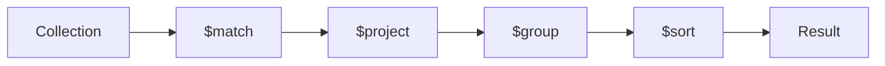

    # MongoDB Aggregation Framework - MAANG Master Sheet

    > **Track File #9 of 28 - Group 02: Intermediate Backend**
    > For: backend/database/system design interviews | Level: intermediate to senior | Mode: pipelines, reports, joins, windows, performance

    This sheet builds:
    - Pipeline mental model
- Core stages and operators
- 10 practical aggregation examples and performance rules

Original master-map sections included here:
- 9. Aggregation Framework

    How to use this:
    - Read the mental model first.
    - Practice the commands and examples in `mongosh` or a driver.
    - Say the interview answers out loud in 30-90 seconds.
    - Revisit the anti-patterns before designing production schemas.

    ---
## 9. Aggregation Framework

### What Is Aggregation?

Aggregation is MongoDB's pipeline framework for transforming, grouping, joining, sorting, and writing derived data.

Mental model: documents flow through stages. Each stage takes documents as input and emits transformed documents.



### Find vs Aggregation

| Find | Aggregation |
|---|---|
| Simple filtering and projection | Multi-stage transformation |
| Best for CRUD reads | Reports, joins, reshaping, grouping |
| Easy to index | Can use indexes early, then pipeline memory rules apply |
| Returns documents as stored | Can return computed shapes |

### Key Stages

#### `$match`

Filters documents. Put it early when possible.

```javascript
{ $match: { tenantId: "t1", status: "PAID" } }
```

#### `$project`

Selects or computes fields.

```javascript
{ $project: { _id: 0, orderId: 1, totalDollars: { $divide: ["$totalCents", 100] } } }
```

#### `$group`

Groups documents.

```javascript
{ $group: { _id: "$status", count: { $sum: 1 }, revenue: { $sum: "$totalCents" } } }
```

#### `$sort`, `$limit`, `$skip`

```javascript
{ $sort: { createdAt: -1 } }
{ $limit: 20 }
{ $skip: 40 }
```

Use `$skip` carefully for deep pages.

#### `$unwind`

Explodes array elements.

```javascript
{ $unwind: "$items" }
```

#### `$lookup`

Joins another collection.

```javascript
{
  $lookup: {
    from: "users",
    localField: "userId",
    foreignField: "_id",
    as: "user"
  }
}
```

Pipeline form:

```javascript
{
  $lookup: {
    from: "orders",
    let: { userId: "$_id" },
    pipeline: [
      { $match: { $expr: { $eq: ["$userId", "$$userId"] } } },
      { $sort: { createdAt: -1 } },
      { $limit: 5 }
    ],
    as: "recentOrders"
  }
}
```

#### `$addFields` / `$set`

```javascript
{ $set: { totalDollars: { $divide: ["$totalCents", 100] } } }
```

#### `$unset`

```javascript
{ $unset: ["internalNotes", "paymentToken"] }
```

#### `$count`

```javascript
{ $count: "total" }
```

#### `$facet`

Runs multiple sub-pipelines in one pass.

```javascript
{
  $facet: {
    results: [{ $sort: { createdAt: -1 } }, { $limit: 20 }],
    total: [{ $count: "count" }]
  }
}
```

#### `$bucket` and `$bucketAuto`

```javascript
{
  $bucket: {
    groupBy: "$totalCents",
    boundaries: [0, 5000, 10000, 50000, 100000],
    default: "100000+",
    output: { count: { $sum: 1 } }
  }
}
```

#### `$replaceRoot`

```javascript
{ $replaceRoot: { newRoot: "$customer" } }
```

#### `$merge` and `$out`

`$merge` writes into a collection and can update existing documents:

```javascript
{
  $merge: {
    into: "orderDailyStats",
    on: "_id",
    whenMatched: "replace",
    whenNotMatched: "insert"
  }
}
```

`$out` replaces a collection with output. Use carefully.

#### `$setWindowFields`

Window functions over sorted partitions:

```javascript
{
  $setWindowFields: {
    partitionBy: "$tenantId",
    sortBy: { day: 1 },
    output: {
      sevenDayMovingAvg: {
        $avg: "$revenueCents",
        window: { documents: [-6, 0] }
      }
    }
  }
}
```

#### `$graphLookup`

Recursive traversal:

```javascript
{
  $graphLookup: {
    from: "categories",
    startWith: "$parentId",
    connectFromField: "parentId",
    connectToField: "_id",
    as: "ancestors"
  }
}
```

Use carefully; recursive traversal can be expensive.

### Common Operators

| Operator | Use |
|---|---|
| `$sum` | Count or sum numeric values |
| `$avg` | Average |
| `$min` / `$max` | Min/max |
| `$first` / `$last` | First/last in group order |
| `$push` | Accumulate array with duplicates |
| `$addToSet` | Accumulate unique values |
| `$cond` | Conditional expression |
| `$ifNull` | Default for null/missing |
| `$map` | Transform array |
| `$filter` | Filter array |
| `$reduce` | Fold array into value |
| `$dateToString` | Format date |
| `$toObjectId` | Convert string to ObjectId |

Examples:

```javascript
{ $ifNull: ["$couponCode", "NONE"] }
```

```javascript
{
  $map: {
    input: "$items",
    as: "item",
    in: { sku: "$$item.sku", lineTotal: { $multiply: ["$$item.priceCents", "$$item.quantity"] } }
  }
}
```

### Example 1: Sales Report

```javascript
db.orders.aggregate([
  { $match: { tenantId: "t1", status: "PAID", createdAt: { $gte: start, $lt: end } } },
  {
    $group: {
      _id: { day: { $dateToString: { format: "%Y-%m-%d", date: "$createdAt" } } },
      orders: { $sum: 1 },
      revenueCents: { $sum: "$totalCents" }
    }
  },
  { $sort: { "_id.day": 1 } }
])
```

Index:

```javascript
db.orders.createIndex({ tenantId: 1, status: 1, createdAt: 1 })
```

### Example 2: User Activity Dashboard

```javascript
db.events.aggregate([
  { $match: { tenantId: "t1", createdAt: { $gte: start, $lt: end } } },
  { $group: { _id: { userId: "$userId", type: "$type" }, count: { $sum: 1 } } },
  { $sort: { count: -1 } },
  { $limit: 100 }
])
```

### Example 3: Group Orders by Status

```javascript
db.orders.aggregate([
  { $match: { tenantId: "t1" } },
  { $group: { _id: "$status", count: { $sum: 1 } } }
])
```

### Example 4: Join Users and Orders

```javascript
db.orders.aggregate([
  { $match: { tenantId: "t1", createdAt: { $gte: start } } },
  { $limit: 100 },
  { $lookup: { from: "users", localField: "userId", foreignField: "_id", as: "user" } },
  { $unwind: "$user" },
  { $project: { orderId: 1, totalCents: 1, "user.email": 1 } }
])
```

### Example 5: Unwind Order Items

```javascript
db.orders.aggregate([
  { $match: { tenantId: "t1", status: "PAID" } },
  { $unwind: "$items" },
  { $group: { _id: "$items.sku", units: { $sum: "$items.quantity" } } },
  { $sort: { units: -1 } },
  { $limit: 10 }
])
```

### Example 6: Faceted Search

```javascript
db.products.aggregate([
  { $match: { tenantId: "t1", category: "laptops", priceCents: { $lte: 200000 } } },
  {
    $facet: {
      results: [{ $sort: { priceCents: 1 } }, { $limit: 20 }],
      brands: [{ $group: { _id: "$brand", count: { $sum: 1 } } }, { $sort: { count: -1 } }],
      priceBands: [{ $bucket: { groupBy: "$priceCents", boundaries: [0, 50000, 100000, 200000], output: { count: { $sum: 1 } } } }]
    }
  }
])
```

### Example 7: Pagination With Count

```javascript
db.orders.aggregate([
  { $match: { tenantId: "t1", status: "PAID" } },
  {
    $facet: {
      data: [{ $sort: { createdAt: -1 } }, { $limit: 20 }],
      metadata: [{ $count: "total" }]
    }
  }
])
```

For high traffic, avoid counting on every page load. Use approximate or cached counts.

### Example 8: Time-Series Aggregation

```javascript
db.deviceMetrics.aggregate([
  { $match: { deviceId: "d1", ts: { $gte: start, $lt: end } } },
  {
    $group: {
      _id: { minute: { $dateToString: { format: "%Y-%m-%dT%H:%M", date: "$ts" } } },
      avgTemp: { $avg: "$temperature" },
      maxTemp: { $max: "$temperature" }
    }
  },
  { $sort: { "_id.minute": 1 } }
])
```

### Example 9: Moving Average

```javascript
db.dailyRevenue.aggregate([
  { $match: { tenantId: "t1" } },
  {
    $setWindowFields: {
      partitionBy: "$tenantId",
      sortBy: { day: 1 },
      output: {
        movingAvgRevenue: {
          $avg: "$revenueCents",
          window: { documents: [-6, 0] }
        }
      }
    }
  }
])
```

### Example 10: Top N Per Group

```javascript
db.orders.aggregate([
  { $match: { tenantId: "t1", status: "PAID" } },
  { $unwind: "$items" },
  { $group: { _id: { category: "$items.category", sku: "$items.sku" }, units: { $sum: "$items.quantity" } } },
  { $sort: { "_id.category": 1, units: -1 } },
  {
    $group: {
      _id: "$_id.category",
      topProducts: { $push: { sku: "$_id.sku", units: "$units" } }
    }
  },
  { $project: { topProducts: { $slice: ["$topProducts", 5] } } }
])
```

### Aggregation Performance Rules

| Rule | Why |
|---|---|
| Put `$match` early | Reduces pipeline input |
| Put `$sort` only when indexed or after reduction | Avoids large blocking sort |
| Project only needed fields | Reduces memory and network |
| Use indexes before pipeline transforms | Indexes help most before `$group`/`$project` changes shape |
| Avoid huge `$lookup` | Can explode memory and latency |
| Avoid unbounded `$group` | High cardinality groups can exceed memory |
| Use `allowDiskUse` carefully | Prevents failure but may be slower |
| Precompute dashboards | Avoid repeated full scans |

Command:

```javascript
db.orders.aggregate(pipeline, { allowDiskUse: true })
```

---

---
