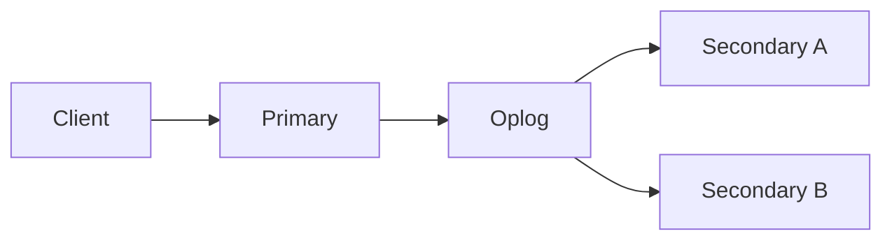

    # MongoDB Replication and High Availability - MAANG Master Sheet

    > **Track File #12 of 28 - Group 03: Senior MAANG**
    > For: backend/database/system design interviews | Level: senior operations and system design | Mode: replica sets, elections, oplog, failover

    This sheet builds:
    - Replica set architecture
- Primary, secondary, elections, failover
- Majority writes, lag, rollback scenarios

Original master-map sections included here:
- 11. Replication

    How to use this:
    - Read the mental model first.
    - Practice the commands and examples in `mongosh` or a driver.
    - Say the interview answers out loud in 30-90 seconds.
    - Revisit the anti-patterns before designing production schemas.

    ---
## 11. Replication

### What Is Replication?

Replication keeps copies of data across multiple MongoDB nodes. A replica set provides high availability and durability.



### Replica Set Components

| Component | Role |
|---|---|
| Primary | Accepts writes |
| Secondary | Replicates data from primary oplog |
| Arbiter | Votes in elections but stores no data; use sparingly |
| Oplog | Capped collection of write operations |
| Election | Process to choose new primary |

### Why Production Uses Replica Sets

- automatic failover
- durable copies
- maintenance without full downtime
- read scaling for stale-tolerant workloads
- required for transactions and change streams in many practical setups

### What Happens When Primary Fails

1. Secondaries detect primary is unavailable.
2. Eligible nodes hold an election.
3. A majority elects a new primary.
4. Clients reconnect through drivers.
5. Writes resume after election completes.

### Majority Write Concern

With `{ w: "majority" }`, a write is acknowledged only after a majority of voting nodes have it.

Why it matters: reduces risk of acknowledged writes rolling back after failover.

### Replication Lag

Replication lag is delay between primary write and secondary applying it.

Causes:

- slow secondary disk
- network latency
- huge write bursts
- long-running operations
- index builds or resource pressure

Impact:

- stale secondary reads
- delayed failover readiness
- oplog window risk

### Rollback Scenarios

If a primary accepts writes that are not replicated to a majority before it steps down, those writes can roll back. Majority write concern reduces this risk.

### Read Preference and Stale Reads

Reading from secondary can return older data.

Use secondary reads for:

- analytics dashboards that tolerate lag
- reporting
- geographically closer reads when stale data is acceptable

Avoid secondary reads for:

- login state immediately after write
- payment/order confirmation
- read-your-write UX unless using causal consistency

### Commands

Initiate local replica set:

```javascript
rs.initiate()
```

Status:

```javascript
rs.status()
```

Configuration:

```javascript
rs.conf()
```

Step down primary:

```javascript
rs.stepDown(60)
```

Add member:

```javascript
rs.add("mongo2.example.com:27017")
```

---

---
