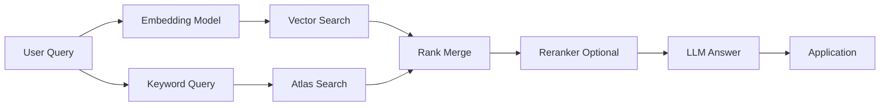

    # MongoDB Search, Vector Search and GenAI RAG - MAANG Master Sheet

    > **Track File #17 of 28 - Group 03: Senior MAANG**
    > For: backend/database/system design interviews | Level: senior GenAI/backend | Mode: Atlas Search, vector search, RAG metadata, hybrid retrieval

    This sheet builds:
    - Text index vs Atlas Search vs Elasticsearch
- Vector embeddings, semantic search, RAG
- Chunk schema, ACL filtering, conversation memory

Original master-map sections included here:
- 18. Full-Text Search and Atlas Search
- 19. Vector Search and GenAI Use Cases

    How to use this:
    - Read the mental model first.
    - Practice the commands and examples in `mongosh` or a driver.
    - Say the interview answers out loud in 30-90 seconds.
    - Revisit the anti-patterns before designing production schemas.

    ---
## 18. Full-Text Search and Atlas Search

### Basic MongoDB Text Index

```javascript
db.articles.createIndex({ title: "text", body: "text" })

db.articles.find(
  { $text: { $search: "mongodb performance" } },
  { score: { $meta: "textScore" }, title: 1 }
).sort({ score: { $meta: "textScore" } })
```

Use text index when:

- search is basic
- language needs are simple
- autocomplete/fuzzy/relevance tuning are not core requirements

### Atlas Search

Atlas Search provides Lucene-powered search integrated with MongoDB Atlas.

Features:

- analyzers
- autocomplete
- fuzzy search
- relevance scoring
- facets
- highlighting
- synonyms
- compound search with filters

Conceptual search query:

```javascript
db.products.aggregate([
  {
    $search: {
      index: "products_search",
      compound: {
        must: [{ text: { query: "wireless keyboard", path: ["name", "description"] } }],
        filter: [{ equals: { path: "tenantId", value: "t1" } }]
      }
    }
  },
  { $limit: 20 },
  { $project: { name: 1, priceCents: 1, score: { $meta: "searchScore" } } }
])
```

### Autocomplete

```javascript
{
  $search: {
    index: "autocomplete",
    autocomplete: {
      query: "keyb",
      path: "name",
      fuzzy: { maxEdits: 1 }
    }
  }
}
```

### Faceting

```javascript
{
  $searchMeta: {
    index: "products_search",
    facet: {
      operator: { text: { query: "laptop", path: "description" } },
      facets: {
        brandFacet: { type: "string", path: "brand" }
      }
    }
  }
}
```

### MongoDB Text vs Atlas Search vs Elasticsearch

| Need | MongoDB Text | Atlas Search | Elasticsearch |
|---|---|---|---|
| Basic keyword search | Good | Good | Good |
| Autocomplete | Limited | Good | Good |
| Fuzzy search | Limited | Good | Good |
| Complex analyzers | Limited | Good | Excellent |
| Dedicated search operations | No | Managed in Atlas | Strong |
| Operational source of truth | Yes | Same MongoDB cluster | Usually separate index |
| Massive search analytics | Limited | Good for many app cases | Strongest |

Rule: use Atlas Search when you want search inside MongoDB Atlas. Use Elasticsearch/OpenSearch when search is a separate large platform with advanced operational needs.

---

---

## 19. Vector Search and GenAI Use Cases

### Core Concepts

| Concept | Meaning |
|---|---|
| Embedding | Numeric vector representing semantic meaning |
| Semantic search | Search by meaning, not exact keyword |
| Similarity search | Find nearest vectors by cosine/dot/euclidean |
| RAG | Retrieval Augmented Generation: retrieve context, then generate answer |
| Metadata filtering | Restrict vector search by tenant, ACL, type, time |
| Hybrid search | Combine keyword relevance and vector similarity |
| Chunk | Smaller piece of a source document embedded separately |
| Conversation memory | Stored messages, summaries, preferences, facts |
| Agent memory | Durable task state, learned facts, tool results |

### MongoDB as GenAI Data Store

MongoDB can act as:

- operational database for app entities
- vector store for embeddings
- metadata store for source documents and chunks
- conversation memory database
- audit log for prompts/responses/tool calls
- RAG access-control-aware store

### RAG Document Schema

```javascript
{
  _id: ObjectId("..."),
  tenantId: "t1",
  sourceDocumentId: "doc-123",
  chunkId: "doc-123:0007",
  text: "MongoDB uses BSON to store documents...",
  embedding: [0.012, -0.044, 0.091],
  metadata: {
    title: "MongoDB Architecture Guide",
    sourceUri: "s3://bucket/doc-123.pdf",
    page: 12,
    section: "Storage",
    tags: ["mongodb", "database"],
    acl: ["team-db", "role-engineering"]
  },
  createdAt: ISODate("2026-07-01T00:00:00Z"),
  embeddingModel: "text-embedding-model",
  contentHash: "sha256:..."
}
```

Indexes:

```javascript
db.ragChunks.createIndex({ tenantId: 1, sourceDocumentId: 1, chunkId: 1 }, { unique: true })
db.ragChunks.createIndex({ tenantId: 1, "metadata.tags": 1 })
db.ragChunks.createIndex({ tenantId: 1, createdAt: -1 })
```

Vector index is configured in Atlas Search, not with normal `createIndex`.

### Vector Search Query Example

```javascript
db.ragChunks.aggregate([
  {
    $vectorSearch: {
      index: "rag_vector_index",
      path: "embedding",
      queryVector: queryEmbedding,
      numCandidates: 200,
      limit: 10,
      filter: {
        tenantId: "t1",
        "metadata.acl": "team-db"
      }
    }
  },
  {
    $project: {
      text: 1,
      sourceDocumentId: 1,
      metadata: 1,
      score: { $meta: "vectorSearchScore" }
    }
  }
])
```

### Hybrid Search Architecture



### Conversation Memory Schema

```javascript
{
  _id: ObjectId("..."),
  tenantId: "t1",
  userId: "u1",
  conversationId: "c1",
  role: "user",
  content: "Explain MongoDB shard keys",
  contentEmbedding: [0.02, 0.03],
  summary: null,
  createdAt: ISODate("2026-07-01T10:00:00Z")
}
```

Indexes:

```javascript
db.messages.createIndex({ tenantId: 1, conversationId: 1, createdAt: 1 })
db.messages.createIndex({ tenantId: 1, userId: 1, createdAt: -1 })
```

### When MongoDB Vector Search Is Enough

- You already use MongoDB/Atlas.
- You need operational metadata plus vectors together.
- RAG corpus is app-scale, not a dedicated internet-scale search platform.
- You need tenant filters and document metadata with embeddings.
- You prefer fewer moving parts.

### When Specialized Vector DB May Be Better

- extremely large vector-only workloads
- advanced ANN tuning requirements
- very high QPS vector search independent of operational database
- specialized filtering/ranking features MongoDB does not provide
- separate search/vector platform team exists

### GenAI Production Concerns

- Store source document ID and chunk lineage.
- Store embedding model and version.
- Re-embed on model upgrades.
- Enforce tenant and ACL filters before LLM context.
- Log prompt, retrieved chunks, model, and output for audit.
- Avoid putting secrets/PII into prompts without policy.
- Add evaluation datasets for retrieval quality.

---

---
