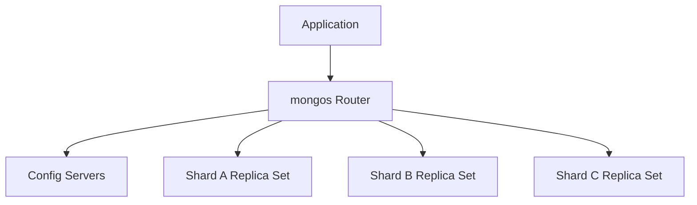

    # MongoDB Sharding and Distributed Scale - MAANG Master Sheet

    > **Track File #13 of 28 - Group 03: Senior MAANG**
    > For: backend/database/system design interviews | Level: MAANG/system design | Mode: horizontal scaling, shard keys, chunk behavior, global systems

    This sheet builds:
    - mongos, config servers, chunks, balancer
- Shard key selection and anti-patterns
- E-commerce, SaaS, IoT, chat, logs examples

Original master-map sections included here:
- 12. Sharding

    How to use this:
    - Read the mental model first.
    - Practice the commands and examples in `mongosh` or a driver.
    - Say the interview answers out loud in 30-90 seconds.
    - Revisit the anti-patterns before designing production schemas.

    ---
## 12. Sharding

### What Is Sharding?

Sharding horizontally partitions data across multiple shards. Each shard stores a subset of data.

Why it exists:

- dataset exceeds one machine's storage
- write throughput exceeds one primary
- working set exceeds memory
- global data placement is needed
- tenant or event scale requires horizontal growth



### Components

| Component | Role |
|---|---|
| Shard | Stores subset of sharded data, usually a replica set |
| `mongos` | Query router used by clients |
| Config servers | Store cluster metadata |
| Chunk | Range of shard key values |
| Balancer | Moves chunks to balance data |
| Shard key | Field(s) determining data distribution |
| Zone sharding | Pins ranges to regions or hardware |

### Shard Key Selection

A good shard key has:

- high cardinality
- even distribution
- query isolation for common queries
- write distribution
- stable value
- no single hot range
- supports growth pattern

Bad shard keys cause production pain that is hard to fix.

### Range-Based Shard Key

```javascript
sh.shardCollection("app.orders", { tenantId: 1, createdAt: 1 })
```

Pros:

- efficient range queries
- targeted queries when prefix known

Cons:

- can hotspot if writes target same range
- tenant skew can imbalance data

### Hashed Shard Key

```javascript
sh.shardCollection("app.events", { userId: "hashed" })
```

Pros:

- good distribution
- avoids monotonic hotspots

Cons:

- range queries on hashed field are not efficient
- query targeting requires exact key

### Compound Shard Key

```javascript
sh.shardCollection("app.orders", { tenantId: 1, orderId: 1 })
```

Use compound keys to combine locality and distribution.

Example multi-tenant key:

```javascript
{ tenantId: 1, createdAt: 1, _id: 1 }
```

If one tenant is huge, tenantId-only is dangerous.

### Zone-Based Sharding

Use zones to place data in regions:

- EU tenant data in EU shards
- US tenant data in US shards
- premium tenants on larger hardware

Conceptual:

```javascript
sh.addShardToZone("shardEU", "EU")
sh.updateZoneKeyRange(
  "app.users",
  { region: "EU", tenantId: MinKey },
  { region: "EU", tenantId: MaxKey },
  "EU"
)
```

### Bad Shard Keys

| Bad Key | Why Bad | Better |
|---|---|---|
| `createdAt` only | Monotonic hotspot | `{ tenantId, createdAt, _id }` or hashed component |
| `status` | Low cardinality | Include tenant/user/order ID |
| `tenantId` only | Huge tenants create jumbo chunks | Compound with high-cardinality suffix |
| random UUID only | Poor query routing | Compound with query prefix |
| field not in queries | Scatter-gather | Include common query filter |

### Targeted vs Scatter-Gather Queries

Targeted query includes shard key prefix:

```javascript
db.orders.find({ tenantId: "t1", orderId: "o1" })
```

Scatter-gather query lacks shard key and hits many shards:

```javascript
db.orders.find({ status: "PAID" })
```

Scatter-gather is not always forbidden, but frequent latency-sensitive scatter-gather is a design smell.

### Chunks and Balancer

MongoDB splits shard key ranges into chunks. The balancer migrates chunks across shards.

Risks:

- chunk migrations consume network and I/O
- jumbo chunks cannot move easily
- poor shard key creates imbalance
- sudden tenant growth can hotspot

### Resharding

Modern MongoDB supports resharding, but it is still operationally significant. Choose shard keys carefully early for high-scale systems.

### Examples

#### E-commerce Orders

Access patterns:

- get order by `tenantId + orderId`
- list tenant orders by time
- dashboard by tenant/date

Shard key candidate:

```javascript
{ tenantId: 1, orderId: 1 }
```

or for time lists:

```javascript
{ tenantId: 1, createdAt: 1, _id: 1 }
```

Watch for huge tenants.

#### Multi-Tenant SaaS

Bad:

```javascript
{ tenantId: 1 }
```

Better when tenants are uneven:

```javascript
{ tenantId: 1, entityId: 1 }
```

or bucket big tenants:

```javascript
{ tenantId: 1, bucketId: 1, entityId: 1 }
```

#### IoT Events

Bad:

```javascript
{ timestamp: 1 }
```

Better:

```javascript
{ deviceId: "hashed" }
```

or:

```javascript
{ tenantId: 1, deviceId: 1, timestamp: 1 }
```

depending on query needs.

#### Chat Messages

Access:

- list messages by conversation/time
- send messages concurrently

Shard key:

```javascript
{ conversationId: 1, bucketId: 1 }
```

For huge conversations, avoid putting all writes for one conversation on one hot chunk if global scale is needed.

#### Logs

Use time partitioning plus distribution key:

```javascript
{ tenantId: 1, dayBucket: 1, _id: 1 }
```

### System Design Prompt

Prompt: Design a globally scalable order system using MongoDB sharding.

Answer outline:

- Collections: `orders`, `orderEvents`, `orderDailyStats`, `inventoryReservations`.
- Shard `orders` by `{ region, tenantId, orderId }` or `{ tenantId, orderId }` depending on data residency.
- Use zone sharding for region residency.
- Index list queries with `{ tenantId, customerId, createdAt }`, `{ tenantId, status, createdAt }`.
- Embed order items and address snapshots.
- Store payment/inventory workflows as state transitions and events.
- Use majority write concern for order state changes.
- Use change streams/outbox for downstream notifications and analytics.
- Precompute dashboards by tenant/day/status.
- Failure handling: idempotent order creation, payment retries, inventory reservation expiration, replayable events.

---

---
