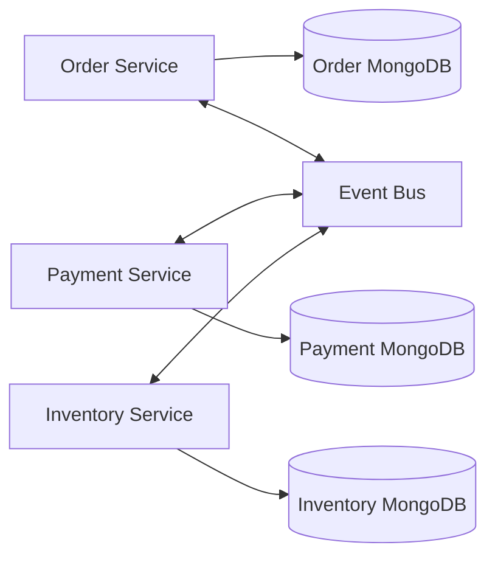

    # MongoDB in Microservices and Production Patterns - Gold Sheet

    > **Track File #20 of 28 - Group 04: Scenario Practice**
    > For: backend/database/system design interviews | Level: senior backend scenarios | Mode: service ownership, events, outbox, saga, versioned documents

    This sheet builds:
    - Database per service
- Outbox, change streams, saga, idempotency
- Order/payment/inventory service example

Original master-map sections included here:
- 21. MongoDB in Microservices

    How to use this:
    - Read the mental model first.
    - Practice the commands and examples in `mongosh` or a driver.
    - Say the interview answers out loud in 30-90 seconds.
    - Revisit the anti-patterns before designing production schemas.

    ---
## 21. MongoDB in Microservices

### Database Per Service

Each service owns its database or collections. Other services do not directly write them.



Why:

- preserves bounded context
- enables independent schema evolution
- prevents hidden coupling
- supports service autonomy

### Avoid Shared Database Ownership

Bad:

- Order service updates payment documents directly.
- Reporting service changes order schema.
- Multiple services depend on private collection fields.

Better:

- service APIs
- events
- read models
- replicated projections

### Event-Driven Sync

Use events to synchronize derived data.

```javascript
{
  eventId: "evt-1",
  type: "ORDER_CREATED",
  aggregateId: "order1",
  occurredAt: ISODate("2026-07-01T10:00:00Z"),
  payload: { tenantId: "t1", totalCents: 5000 }
}
```

### Outbox Pattern

Problem: writing database and publishing event can fail halfway.

Solution: write domain change and outbox event in same transaction or same document aggregate; relay publishes later.

```javascript
// outboxEvents
{
  _id: "evt-1",
  aggregateId: "order1",
  type: "ORDER_CREATED",
  payload: { orderId: "order1" },
  status: "PENDING",
  createdAt: ISODate("2026-07-01T10:00:00Z")
}
```

Relay:

1. Find pending events.
2. Publish to Kafka/SNS/SQS.
3. Mark published idempotently.

### Change Streams as Event Source

Change streams can feed downstream processors, but consider outbox when you need explicit event contracts, retries, and external publishing guarantees.

### Saga Pattern

Order workflow:

1. Order service creates order `PENDING`.
2. Inventory reserves stock.
3. Payment captures money.
4. Order becomes `CONFIRMED`.
5. On failure, compensating actions release inventory or refund payment.

MongoDB stores state transitions and idempotency keys.

### Idempotent Writes

Use unique operation IDs:

```javascript
db.processedEvents.createIndex({ consumerName: 1, eventId: 1 }, { unique: true })
```

Handler checks/records event before side effects.

### Schema Evolution

Use versioned documents:

```javascript
{
  _id: "order1",
  schemaVersion: 3,
  status: "PAID"
}
```

Strategies:

- read old and new versions
- backfill gradually
- write new version after deployment
- use validators after migration stabilizes

### Example: Order + Payment + Inventory

Collections:

- `orders`: current order aggregate
- `orderEvents`: event history
- `outboxEvents`: integration events
- `inventoryReservations`: reservations with TTL/expiry
- `paymentAttempts`: idempotent payment attempts

Consistency:

- order state eventually consistent with payment/inventory
- user sees pending states
- retries are idempotent
- compensating actions handle failures

---

---
