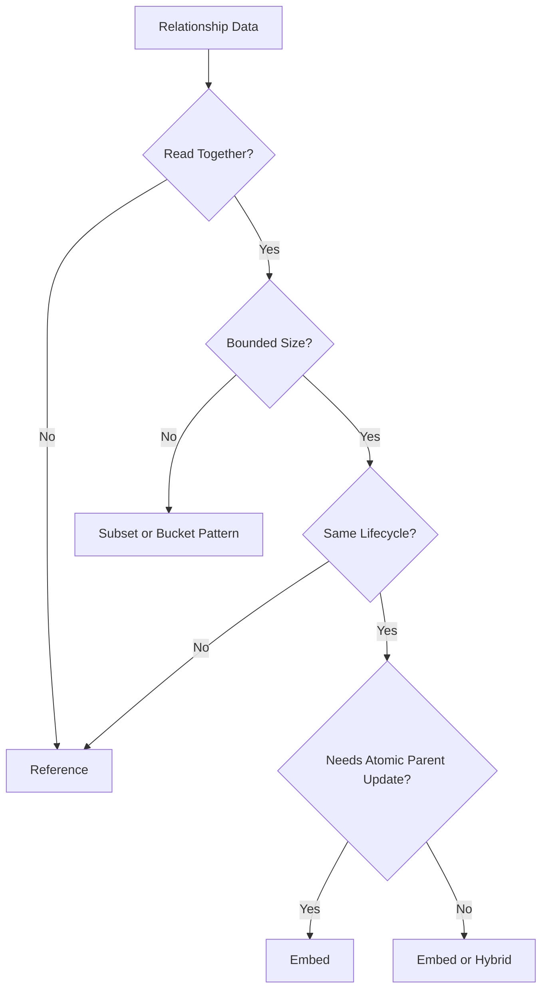
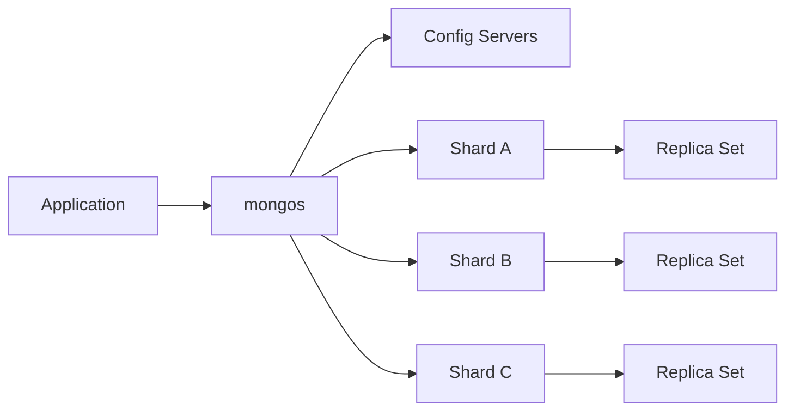
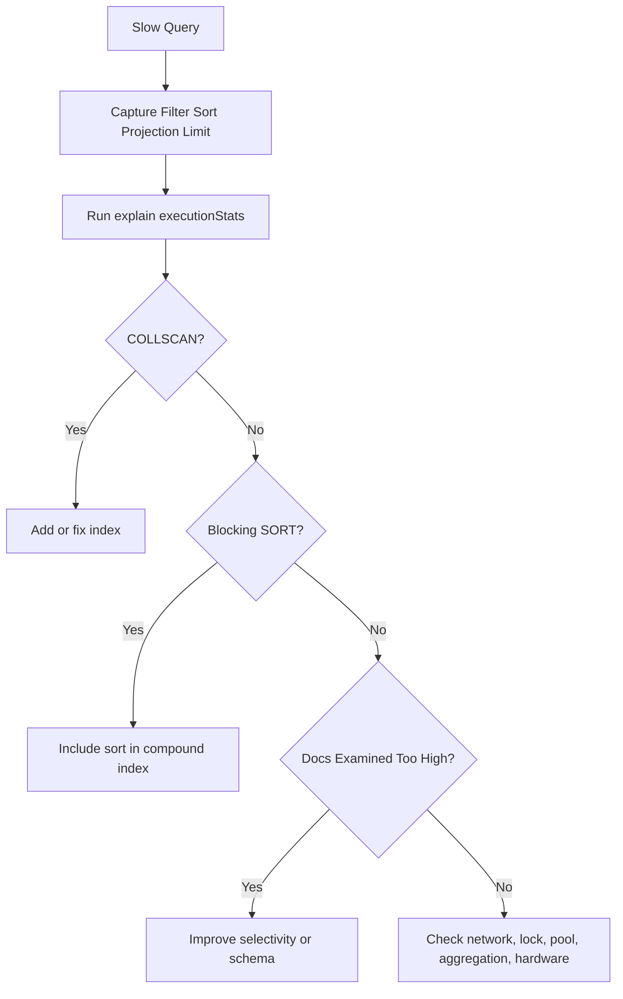
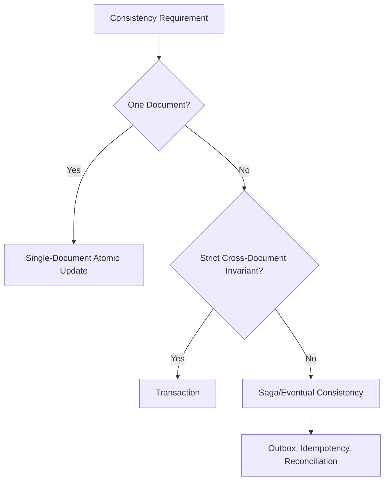
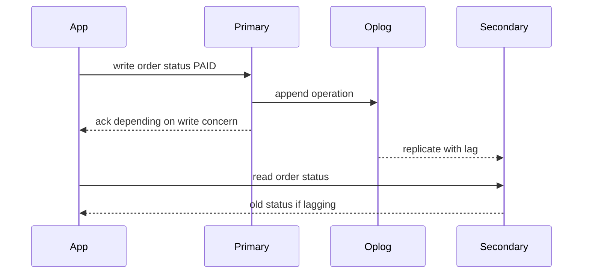
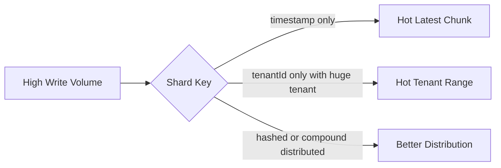
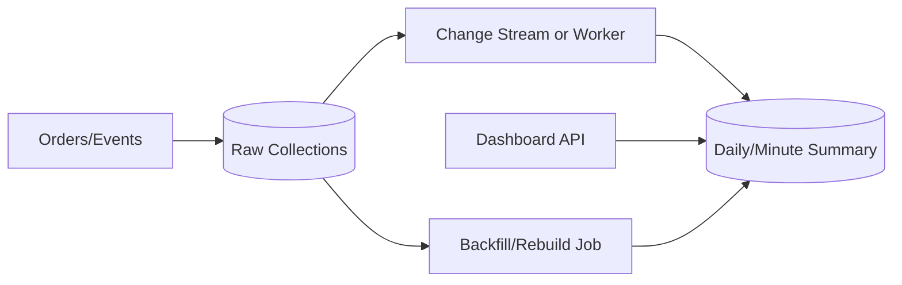
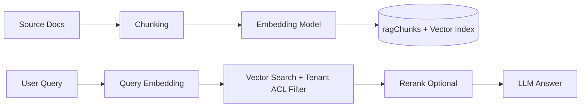
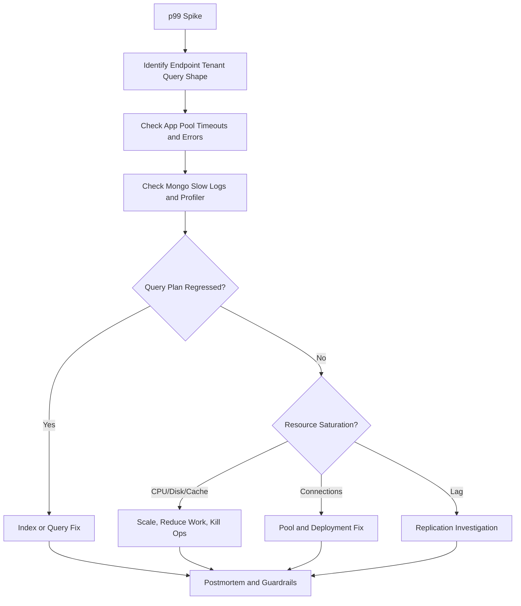

# MAANG MongoDB Deep-Dive Q&A

This sheet is for senior backend and system design interviews where MongoDB is not tested as syntax, but as a set of architecture tradeoffs under scale, skew, failures, and production constraints.

Use each card like this:

1. Answer the prompt out loud in 90 seconds.
2. Add one concrete schema, index, or query.
3. Name the tradeoff.
4. Name the failure mode.
5. Explain how you would debug or monitor it in production.

---

## 1. Schema Design Tradeoffs

### Interview Prompt

You are designing an order service in MongoDB. How do you decide the document shape?

### Expected Answer

I start from access patterns and atomicity boundaries, not from entities. For orders, the order detail page almost always needs order metadata, line items, totals, and address snapshot together. Line items are bounded and owned by the order, so I embed them. Product details and inventory are separate because they change independently. I store product name and price snapshots inside the order because historical orders should not change when product catalog data changes.

```javascript
{
  tenantId: 't1',
  orderId: 'ORD-1001',
  customerId: 'u1',
  status: 'PAID',
  items: [
    { sku: 'SKU-1', productName: 'Keyboard', quantity: 1, priceCents: 7999 }
  ],
  totalCents: 7999,
  shippingAddress: { city: 'Dallas', state: 'TX' },
  createdAt: ISODate('2026-07-01T10:00:00Z')
}
```

### Tradeoffs

| Choice | Benefit | Cost |
|---|---|---|
| Embed order items | fast order detail, atomic update | larger order document |
| Reference customer | avoids duplicating mutable profile | needs extra query for current profile |
| Snapshot product name/price | historical correctness | duplicated stale catalog fields by design |
| Precompute totals | fast reads | must maintain on writes |

### Interviewer Follow-Ups

- What if line items grow to thousands? Cap the cart/order size, split extreme outliers, or use an order item collection for rare enterprise orders.
- What if product price changes? Order stores a price snapshot. Catalog stores current price.
- What if reporting needs joins across many entities? Use aggregation/read models or export to OLAP/PostgreSQL depending workload.

---

## 2. Embedding vs Referencing

### Interview Prompt

When should you embed and when should you reference?

### Expected Answer

Embed bounded data that is owned by the parent and read or updated with it. Reference unbounded, shared, large, or independently changing data. MongoDB is strongest when a document maps to an aggregate, not when every SQL table becomes a separate collection.



### Examples

| Relationship | Recommended Model | Why |
|---|---|---|
| order to line items | embed | bounded, owned, read together |
| product to reviews | reference plus subset | reviews are unbounded |
| user to roles | embed for small roles | authorization needs roles quickly |
| social followers | edge collection | graph-like many-to-many |
| RAG document to chunks | reference chunks | chunks are searched independently |

### Failure Mode

The classic failure is an unbounded array. A product with millions of reviews or a chat conversation with millions of messages will hit document growth, update, and 16 MB limits.

---

## 3. Shard Key Selection

### Interview Prompt

Choose a shard key for a multi-tenant order system.

### Expected Answer

I evaluate shard key candidates by cardinality, distribution, query targeting, write distribution, tenant skew, and stability. For orders, `{ tenantId, orderId }` targets common get-order queries and distributes within tenant if `orderId` is high cardinality. For tenant order history queries, I still need secondary indexes like `{ tenantId, customerId, createdAt }`. If tenant sizes are extremely skewed, tenantId-only is dangerous because one large tenant can create hot chunks.



### Candidate Comparison

| Shard Key | Good | Bad |
|---|---|---|
| `{ tenantId: 1 }` | tenant-local queries | huge tenant hotspots |
| `{ tenantId: 1, orderId: 1 }` | targeted order lookup, better spread | tenant history may still scan tenant range |
| `{ orderId: 'hashed' }` | write distribution | tenant queries scatter |
| `{ region: 1, tenantId: 1, orderId: 1 }` | data residency | more complex routing |
| `{ createdAt: 1 }` | range queries | monotonic write hotspot |

### Strong Answer Line

A shard key is not only a distribution key. It is also a query routing contract.

---

## 4. Query Optimization

### Interview Prompt

An API returns 20 orders but examines 2 million documents. How do you debug it?

### Expected Answer

I capture the exact query shape, run `explain('executionStats')`, inspect `winningPlan`, compare `nReturned`, `totalKeysExamined`, and `totalDocsExamined`, and check for `COLLSCAN` or blocking `SORT`. Then I design a compound index around the filter and sort. If the right index still cannot help, I consider schema redesign, pre-aggregation, or query restrictions.

```javascript
db.orders.find({ tenantId: 't1', status: 'PAID' })
  .sort({ createdAt: -1 })
  .limit(20)
  .explain('executionStats')
```

Expected index:

```javascript
db.orders.createIndex({ tenantId: 1, status: 1, createdAt: -1 })
```



### Tradeoff

Adding an index helps reads but slows writes and increases memory/storage use. For a write-heavy collection, every index must justify its cost.

---

## 5. Index Design

### Interview Prompt

Explain how you design compound indexes in MongoDB.

### Expected Answer

I start from concrete query shapes. I order fields using equality, sort, then range as a default heuristic, validate with `explain()`, and avoid indexes that are not tied to real queries. I also consider cardinality and selectivity. Low-cardinality fields like `status` are usually weak alone but useful after a selective prefix such as `tenantId`.

### Example

Query:

```javascript
db.auditLogs.find({
  tenantId: 't1',
  actorId: 'u1',
  createdAt: { $gte: start, $lt: end }
}).sort({ createdAt: -1 })
```

Index:

```javascript
db.auditLogs.createIndex({ tenantId: 1, actorId: 1, createdAt: -1 })
```

### Tradeoffs

| Index Type | Use | Risk |
|---|---|---|
| compound | hot multi-field query | wrong order reduces usefulness |
| multikey | array search | index entry explosion |
| partial | subset queries | query must match filter |
| TTL | expiry | deletion is not immediate |
| wildcard | flexible attributes | memory/storage pressure |
| text | basic search | limited relevance/search features |

### Red Flags

- Index count grows without ownership.
- Duplicate indexes exist.
- Indexes are added without explain evidence.
- Hot writes slow after indexing.
- Sort is not covered by index.

---

## 6. Aggregation at Scale

### Interview Prompt

How do you run aggregation pipelines safely on large collections?

### Expected Answer

I reduce early with `$match`, preserve index usage before reshaping stages, project large fields out, avoid unbounded `$group`, limit before `$lookup` when possible, and precompute repeated dashboards into summary collections. For high-cardinality or repeated analytics, MongoDB aggregation may feed a materialized view or an OLAP system rather than running full scans on every request.

### Good Pipeline Shape

```javascript
db.orders.aggregate([
  { $match: { tenantId: 't1', status: 'PAID', createdAt: { $gte: start, $lt: end } } },
  { $project: { tenantId: 1, items: 1, totalCents: 1, createdAt: 1 } },
  { $unwind: '$items' },
  { $group: { _id: '$items.category', revenueCents: { $sum: { $multiply: ['$items.quantity', '$items.priceCents'] } } } },
  { $sort: { revenueCents: -1 } }
], { allowDiskUse: true })
```

### Tradeoffs

| Technique | Benefit | Risk |
|---|---|---|
| `$match` early | less input | only helps if selective/indexed |
| `$project` early | less memory | can remove fields needed later |
| `$lookup` after `$limit` | bounded join | not always semantically valid |
| `$merge` summaries | fast dashboards | eventual consistency |
| `allowDiskUse` | avoids memory failure | slower disk spill |

---

## 7. Consistency Tradeoffs

### Interview Prompt

How do you reason about consistency in MongoDB?

### Expected Answer

I separate single-document atomicity, multi-document transactions, read concern, write concern, read preference, and application-level eventual consistency. MongoDB gives atomic updates within one document, so schema design can reduce the need for transactions. For cross-document workflows, I choose between transactions and sagas based on invariant strictness, latency, failure handling, and service boundaries.



### Examples

| Scenario | Consistency Choice |
|---|---|
| cart update | single-document atomic update |
| money transfer | transaction |
| order/payment/inventory across services | saga plus outbox |
| dashboard counters | eventual consistency and rebuild |
| RAG ingestion status | eventual consistency with job state |

---

## 8. Replication Lag

### Interview Prompt

Users read stale data after a write. What could be happening?

### Expected Answer

If reads are going to secondaries, replication lag can cause stale reads. The primary accepted the write, but a secondary has not applied the oplog entry yet. I would check read preference, replication lag, write concern, causal consistency requirements, and whether the user flow requires read-your-writes.



### Debug Steps

- Check `rs.status()` and replication lag metrics.
- Confirm read preference.
- Check write concern.
- Check secondary disk/network pressure.
- Check long-running operations or index builds.
- Move read-your-write paths to primary or use causal consistency.

---

## 9. Write Concern and Read Concern

### Interview Prompt

Explain write concern, read concern, and read preference with an example.

### Expected Answer

Write concern controls when a write is acknowledged. Read concern controls what data a read can observe. Read preference controls which replica set member handles reads. For critical order state, I usually use majority write concern. For read-your-write user flows, I read from primary or use causal consistency. For analytics that can tolerate staleness, secondary reads may be acceptable.

| Concept | Question Answered | Example |
|---|---|---|
| write concern | When is my write durable enough? | `{ w: 'majority' }` |
| read concern | What version of data can I see? | `majority`, `snapshot` |
| read preference | Which node do I read from? | `primary`, `secondary` |

### Tradeoff

Stronger concerns usually increase latency but reduce rollback/staleness risk.

---

## 10. Transaction Overhead

### Interview Prompt

Why not use MongoDB transactions everywhere?

### Expected Answer

Transactions have latency, resource, locking/conflict, oplog, and retry overhead. They are valuable for strict cross-document invariants, but they are not a substitute for good aggregate design. If the operation can be modeled as one document update, that is usually cheaper and simpler.

### Transaction vs Redesign

| Need | Prefer |
|---|---|
| update cart item and cart total | one cart document |
| reserve inventory in one SKU document | conditional atomic update |
| transfer money between accounts | transaction |
| order/payment/inventory across services | saga/outbox |
| update read model counters | eventual consistency |

### Red Flags

- Long user workflow inside one transaction.
- Large batch update in one transaction.
- Transactions across service ownership boundaries.
- No retry logic for transient transaction errors.

---

## 11. Hot Partitions

### Interview Prompt

A sharded MongoDB cluster has one hot shard. What do you inspect?

### Expected Answer

I inspect shard key distribution, chunk distribution, balancer status, write pattern, tenant skew, monotonic keys, jumbo chunks, and query targeting. Hot partitions often come from low-cardinality shard keys, monotonic timestamp keys, or a few huge tenants.



### Fix Options

- Reshard with better key.
- Add bucket or high-cardinality suffix.
- Use zone sharding intentionally.
- Isolate huge tenants.
- Pre-split or rebalance chunks if appropriate.
- Move hot counters/events to bucketed design.

---

## 12. Multi-Tenant SaaS Design

### Interview Prompt

Design MongoDB for a multi-tenant SaaS platform.

### Expected Answer

Every tenant-owned document includes `tenantId`. Repository methods require tenant ID from auth context, not from request body. Unique indexes are tenant-scoped. Most query indexes start with `tenantId`. For sharding, tenantId-only is risky if tenants are skewed, so I consider `{ tenantId, entityId }`, buckets, or dedicated shards for large tenants. I also design tenant export/delete, audit logs, and tenant isolation tests.

### Core Indexes

```javascript
db.users.createIndex({ tenantId: 1, email: 1 }, { unique: true })
db.projects.createIndex({ tenantId: 1, projectId: 1 }, { unique: true })
db.auditLogs.createIndex({ tenantId: 1, createdAt: -1 })
```

### Failure Modes

- Missing tenant filter leaks data.
- Huge tenant creates hot shard.
- Cross-tenant analytics overloads OLTP cluster.
- Unique index missing tenant prefix blocks valid duplicates across tenants.

---

## 13. Chat Message Storage

### Interview Prompt

Design chat message storage in MongoDB for large group conversations.

### Expected Answer

I store messages as separate documents, not as an unbounded array inside the conversation. I index by `conversationId`, `createdAt`, and `_id` for cursor pagination. I keep read receipts separate because they update frequently. For very large conversations, I use buckets or a compound shard key such as `{ conversationId, bucketId }`, and I plan for hot conversations.

```javascript
db.messages.createIndex({ conversationId: 1, createdAt: -1, _id: -1 })
db.messages.createIndex({ conversationId: 1, clientMessageId: 1 }, { unique: true })
```

### Tradeoffs

| Design | Benefit | Cost |
|---|---|---|
| message per document | pagination, archive, shardable | more documents |
| embed latest messages in conversation | fast conversation list | duplicate maintenance |
| read receipts separate | avoids message rewrites | extra query/read model |
| bucket messages | reduces index/doc overhead | more complex pagination |

---

## 14. Audit Logging

### Interview Prompt

Design an audit logging system with MongoDB.

### Expected Answer

Audit logs should be append-only, tenant/time indexed, access-controlled, and retention-aware. I store actor, action, target, metadata, IP/request context, and timestamp. For compliance-critical logs, I use majority write concern and restrict write paths. For high volume, I shard by tenant plus time/bucket and archive old data.

```javascript
db.auditLogs.createIndex({ tenantId: 1, createdAt: -1 })
db.auditLogs.createIndex({ tenantId: 1, actorId: 1, createdAt: -1 })
db.auditLogs.createIndex({ tenantId: 1, 'target.type': 1, 'target.id': 1, createdAt: -1 })
```

### Failure Modes

- Audit writes fail silently.
- Logs are mutable by normal app users.
- Retention deletes compliance-required data.
- Unindexed investigation queries scan huge collections.

---

## 15. Large-Scale Event Ingestion

### Interview Prompt

How would you model large-scale event ingestion in MongoDB?

### Expected Answer

I model events as append-only documents or time-series/bucketed documents depending the query pattern. I batch writes, minimize indexes on the hot ingestion collection, use TTL/archive strategy, and maintain read-optimized summaries separately. For extremely high-volume streams, MongoDB may be an operational store while Kafka/object storage/OLAP handle long-term analytics.

### Event Shape

```javascript
{
  tenantId: 't1',
  eventType: 'ORDER_CREATED',
  entityId: 'o1001',
  payload: { totalCents: 7999 },
  occurredAt: ISODate('2026-07-01T10:00:00Z'),
  ingestedAt: ISODate('2026-07-01T10:00:01Z')
}
```

### Tradeoffs

| Choice | Benefit | Cost |
|---|---|---|
| many indexes | flexible queries | slow ingestion |
| few indexes | fast writes | limited direct queries |
| TTL | automatic cleanup | not exact timing |
| summaries | fast dashboards | eventual consistency |
| bucket pattern | fewer docs | complex writes/reads |

---

## 16. Real-Time Dashboards

### Interview Prompt

Design a real-time dashboard on top of MongoDB orders/events.

### Expected Answer

I avoid grouping raw events on every dashboard request. I store raw events/orders as source of truth and maintain summary collections using change streams, stream processors, scheduled aggregation, or application writes. Dashboards read summaries by tenant/time/status. I show freshness when eventual consistency matters and support rebuilding summaries from raw data.



### Summary Index

```javascript
db.orderDailyStats.createIndex({ tenantId: 1, day: -1, status: 1 })
```

### Failure Modes

- Projection worker lags.
- Duplicate event updates counter twice.
- Summary is corrupted and cannot be rebuilt.
- Dashboard queries raw collection during peak traffic.

---

## 17. RAG and GenAI Metadata Store

### Interview Prompt

Design MongoDB as a RAG metadata and vector store.

### Expected Answer

I store chunks with text, embeddings, source document lineage, tenant ID, ACLs, tags, page/section metadata, embedding model version, and content hash. Vector search retrieves semantically similar chunks, but authorization is enforced through tenant and ACL filters. I track ingestion jobs, support source deletion, and plan re-embedding when models change.



### Required Indexes

```javascript
db.ragChunks.createIndex({ tenantId: 1, sourceDocumentId: 1, chunkId: 1 }, { unique: true })
db.ragChunks.createIndex({ tenantId: 1, 'metadata.tags': 1 })
```

### Tradeoffs

MongoDB Vector Search is attractive when operational metadata and vectors belong together. A specialized vector database may be better for massive vector-only QPS, advanced ANN tuning, or independent vector platform ownership.

---

## 18. MongoDB vs PostgreSQL Tradeoffs

### Interview Prompt

When would you choose MongoDB over PostgreSQL, and when would you avoid it?

### Expected Answer

I choose MongoDB when the data is aggregate-shaped, JSON-like, evolving, and the hot reads map naturally to documents. I choose PostgreSQL when relational integrity, complex joins, constraints, ad hoc SQL reporting, and mature transactional semantics dominate.

| Dimension | MongoDB | PostgreSQL |
|---|---|---|
| Data shape | nested aggregates | normalized relations |
| Joins | limited, avoid hot-path join chains | first-class |
| Schema evolution | flexible/versioned documents | migrations |
| Transactions | supported, but design around documents | core strength |
| Reporting | aggregation/read models | SQL/ad hoc reporting |
| Scale | sharding built in | depends on architecture |

### Hybrid Pattern

Use MongoDB for product catalog/profile/RAG metadata, PostgreSQL for financial ledger/reporting-heavy relational core, and Elasticsearch/OpenSearch for dedicated search if Atlas Search is not enough.

---

## 19. Failure Modes

### Interview Prompt

What MongoDB failure modes do you plan for in system design?

### Expected Answer

I plan for primary failover, replication lag, stale reads, rollbacks if write concern is weak, hot shards, bad shard keys, slow queries, index bloat, document growth, unbounded arrays, transaction conflicts, backup restore failure, search/vector index lag, and tenant data leaks.

### Failure Mode Table

| Failure | User Symptom | Mitigation |
|---|---|---|
| primary failover | brief write errors | driver retry, majority writes |
| replication lag | stale reads | primary reads for critical paths |
| bad shard key | hot shard, high latency | reshard/bucket/better key |
| missing index | slow API | explain and compound index |
| unbounded array | large docs, write failures | split/bucket/subset |
| transaction conflict | retries/errors | short transactions and retry logic |
| backup not restorable | DR failure | restore drills |
| tenant filter missing | data leak | repository guard and tests |

---

## 20. Debugging Production Incidents

### Interview Prompt

A MongoDB-backed API has p99 latency spikes. Walk through your incident response.

### Expected Answer

I first determine blast radius: which endpoints, tenants, collections, and time window. Then I inspect app metrics, MongoDB slow queries, profiler, connection pools, current operations, CPU, memory/cache, disk I/O, replication lag, and recent deploy/index changes. I identify the query shape, run explain, and choose a mitigation: add/hide/drop index, kill runaway op, reduce traffic, disable expensive feature, switch read path, scale cluster, or deploy query/schema fix. After recovery, I add regression tests, alerts, and capacity guardrails.



### Production Commands

```javascript
db.currentOp()
db.serverStatus()
db.setProfilingLevel(1, { slowms: 100 })
db.system.profile.find().sort({ ts: -1 }).limit(10)
db.orders.aggregate([{ $indexStats: {} }])
rs.status()
```

### Strong Closing Answer

I do not treat MongoDB incidents as only database incidents. I correlate application deployment, query shape, index state, data growth, tenant skew, connection pools, replication, and hardware metrics. The fix may be an index, but it may also be schema redesign, traffic shaping, read model creation, or tenant isolation.
