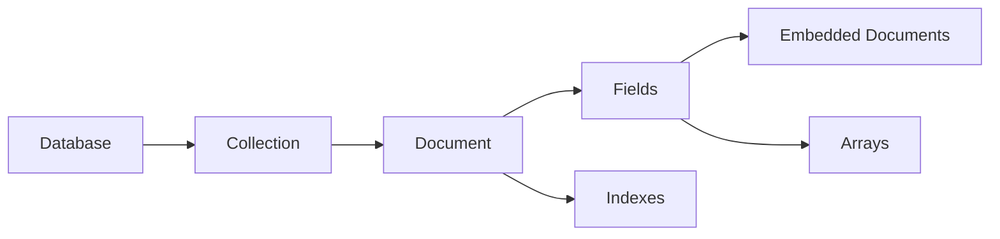
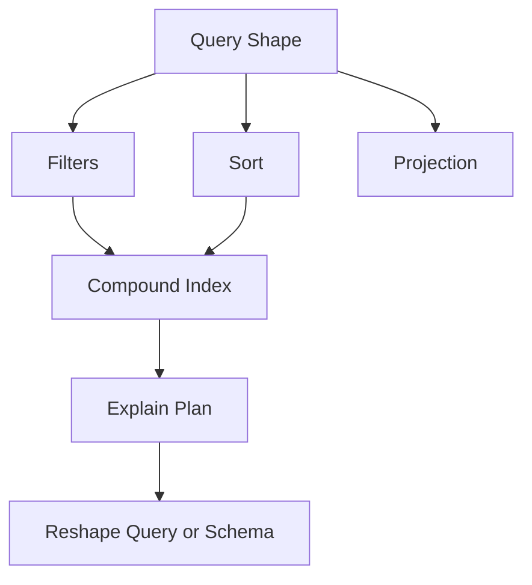
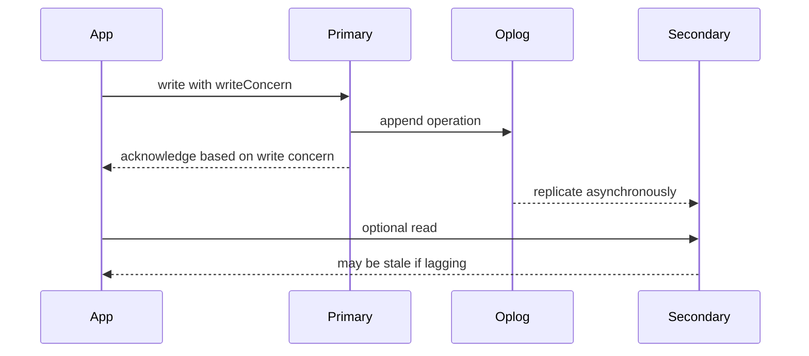
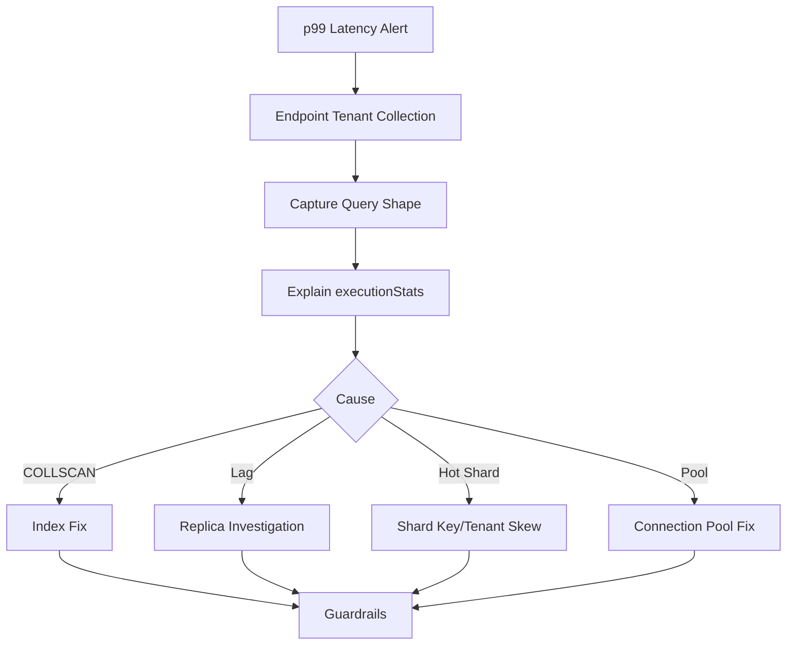

# MongoDB 100 Interview Drills for Senior Backend Engineers

Use this sheet for active recall. Each drill has a concise answer, a concrete example, a trap, and a follow-up. Do not memorize wording; practice explaining the tradeoff under changing requirements.

---

## How to Use This Sheet

1. Answer each question in 60 to 90 seconds.
2. Say the example out loud, not only the definition.
3. Name the trap before the interviewer asks.
4. For senior rounds, always add consistency, index, scale, and failure-mode implications.

---

## Beginner Drills

**Q1. What is MongoDB, and when is it a good fit?**

Answer: MongoDB is a document database that stores BSON documents and works well when data is aggregate-shaped, JSON-like, and read mostly by document-oriented access patterns.

Example: A user profile with preferences and settings can be one document.

Trap: Saying MongoDB is good because it is schema-less. In production, MongoDB needs intentional schema design.

Follow-up: When would PostgreSQL be a better fit?

**Q2. What is a collection?**

Answer: A collection is a group of documents, roughly comparable to a table, but documents in a collection can have flexible shapes.

Example: `users`, `orders`, `products`, and `auditLogs` can be collections.

Trap: Treating each collection like a normalized SQL table by default.

Follow-up: Should comments be in a `posts` document or a `comments` collection?

**Q3. What is BSON?**

Answer: BSON is MongoDB's binary representation of JSON-like documents, with extra types such as `ObjectId`, `Date`, `Decimal128`, and binary data.

Example: `createdAt: ISODate('2026-07-01T10:00:00Z')` is stored as a BSON date.

Trap: Assuming BSON is exactly JSON.

Follow-up: Why does type consistency matter for indexes?

**Q4. What is `_id`?**

Answer: `_id` is the required primary key field for every MongoDB document and is automatically indexed.

Example: `{ _id: 'usr_1001', tenantId: 't1', email: 'asha@example.com' }`.

Trap: Using a mutable business field as `_id` when it may change.

Follow-up: When would you use a custom `_id` instead of `ObjectId`?

**Q5. What is `ObjectId`?**

Answer: `ObjectId` is a 12-byte identifier commonly used as MongoDB's default `_id` value. It includes timestamp-like ordering but should not be treated as a full business timestamp.

Example: `ObjectId('6684f9a4e2b1f6d6b3c0a111')`.

Trap: Depending on `ObjectId` ordering for all application time semantics.

Follow-up: Why might an externally generated UUID be better in distributed systems?

**Q6. What is an embedded document?**

Answer: An embedded document is a nested object stored inside another document.

Example: `{ userId: 'u1', profile: { city: 'Dallas', timezone: 'America/Chicago' } }`.

Trap: Embedding unbounded child data like all product reviews forever.

Follow-up: What makes embedded data safe to embed?

**Q7. What is the difference between embedding and referencing?**

Answer: Embedding stores related data in the same document; referencing stores related data in a separate document and links by ID.

Example: Embed order line items, reference product reviews.

Trap: Using embedding or referencing as a universal rule instead of access-pattern decision.

Follow-up: How does the 16 MB document limit affect this choice?

**Q8. What is a flexible schema?**

Answer: MongoDB does not force all documents in a collection to have identical fields, but production systems still enforce expected shapes through application validation, JSON schema, and migrations.

Example: Product `attributes` can differ by category.

Trap: Letting every document drift into a different shape.

Follow-up: How do you version a document schema?

**Q9. What is a projection?**

Answer: A projection selects which fields are returned by a query.

Example: `db.users.find({ tenantId: 't1' }, { email: 1, displayName: 1 })`.

Trap: Returning large fields like post body or embeddings in list views.

Follow-up: How can projection help performance and security?

**Q10. What is the difference between `insertOne` and `insertMany`?**

Answer: `insertOne` writes one document; `insertMany` writes multiple documents in one operation and is better for batch insertion.

Example: Seed 1,000 telemetry readings with `insertMany`.

Trap: Assuming `insertMany` means all inserts are always atomic as one logical unit across documents.

Follow-up: What changes if `ordered: false` is used?

**Q11. What is `findOne` vs `find`?**

Answer: `findOne` returns one matching document; `find` returns a cursor over all matching documents.

Example: Use `findOne({ tenantId, email })` for login lookup.

Trap: Calling `find()` without limit on a large collection.

Follow-up: Why is cursor pagination better than deep skip?

**Q12. What are update operators?**

Answer: Update operators modify fields without replacing the whole document.

Example: `$set`, `$inc`, `$push`, `$pull`, and `$unset`.

Trap: Replacing the whole document accidentally and losing fields.

Follow-up: When would you use `$addToSet` instead of `$push`?

**Q13. What is an upsert?**

Answer: An upsert updates a matching document or inserts a new one if none matches.

Example: `updateOne({ userId }, { $set: data }, { upsert: true })`.

Trap: Upserting without a unique filter and creating duplicate logical records.

Follow-up: What index should protect an upsert path?

**Q14. What is single-document atomicity?**

Answer: MongoDB guarantees atomicity for updates to a single document.

Example: Updating a cart item and cart total in one cart document can be atomic.

Trap: Assuming two separate documents update atomically without a transaction.

Follow-up: How does schema design reduce transaction needs?

**Q15. What is a query operator?**

Answer: A query operator expresses predicates beyond equality.

Example: `{ createdAt: { $gte: start, $lt: end }, status: { $in: ['PAID', 'SHIPPED'] } }`.

Trap: Using unbounded regex or unindexed range queries on hot paths.

Follow-up: Which fields should be indexed for that query?

**Q16. What is a multikey index?**

Answer: A multikey index indexes values inside arrays.

Example: `db.products.createIndex({ tags: 1 })` supports `{ tags: 'mongodb' }`.

Trap: Large arrays create many index entries and increase write cost.

Follow-up: How can array indexing affect compound indexes?

**Q17. What is a unique index?**

Answer: A unique index prevents duplicate values for indexed fields.

Example: `db.users.createIndex({ tenantId: 1, email: 1 }, { unique: true })`.

Trap: Making `email` globally unique in a multi-tenant SaaS when uniqueness should be per tenant.

Follow-up: How do partial unique indexes help soft deletes?

**Q18. What is a TTL index?**

Answer: A TTL index automatically deletes documents after a date or age.

Example: `db.sessions.createIndex({ expiresAt: 1 }, { expireAfterSeconds: 0 })`.

Trap: Expecting deletion at the exact expiration second.

Follow-up: Why should TTL not be the only compliance deletion mechanism?

**Q19. What is the aggregation framework?**

Answer: It is MongoDB's pipeline-based data processing framework for filtering, grouping, transforming, joining, and writing results.

Example: `$match`, `$group`, `$sort`, `$project`, `$lookup`, `$merge`.

Trap: Running expensive raw aggregations for every dashboard request.

Follow-up: When would you precompute summaries?

**Q20. What is a replica set?**

Answer: A replica set is a group of MongoDB nodes that maintain copies of the same data for high availability.

Example: One primary accepts writes; secondaries replicate the oplog.

Trap: Assuming secondary reads are always current.

Follow-up: What is replication lag?

**Q21. What is sharding?**

Answer: Sharding distributes data across multiple shards using a shard key so storage and traffic can scale horizontally.

Example: Large event collections may be sharded by tenant and bucket.

Trap: Choosing a shard key after data is already huge without considering query routing.

Follow-up: What makes a shard key good?

**Q22. What is write concern?**

Answer: Write concern controls when MongoDB acknowledges a write.

Example: `{ w: 'majority' }` waits for a majority of replica set members.

Trap: Using `w: 1` for critical business state without understanding rollback risk.

Follow-up: What latency tradeoff does majority write concern introduce?

**Q23. What is read concern?**

Answer: Read concern controls what durability or snapshot level a read observes.

Example: `majority` reads data acknowledged by a majority.

Trap: Confusing read concern with read preference.

Follow-up: What read concern is used inside snapshot transactions?

**Q24. What is read preference?**

Answer: Read preference controls which replica set member serves reads.

Example: `primary`, `secondary`, or `primaryPreferred`.

Trap: Sending read-your-write flows to secondaries and seeing stale data.

Follow-up: When are secondary reads acceptable?

**Q25. What is `explain()`?**

Answer: `explain()` shows how MongoDB plans and executes a query.

Example: `db.orders.find({ tenantId, status }).sort({ createdAt: -1 }).explain('executionStats')`.

Trap: Adding indexes without checking whether the query actually uses them.

Follow-up: Which explain fields matter most for slow-query debugging?

---

## Intermediate Drills

**Q26. How do you decide embed vs reference?**

Answer: Embed bounded, owned, frequently read-together data; reference unbounded, shared, independently changing, or large data.

Example: Embed order items, reference product reviews.

Trap: Saying embedding is always faster. It can create huge documents and write amplification.

Follow-up: What if the child data is only sometimes needed?

**Q27. What is the subset pattern?**

Answer: Keep a small subset of child data on the parent and the full data in a separate collection.

Example: Store latest 3 reviews on a product, full reviews in `productReviews`.

Trap: Forgetting that the subset is duplicated and must be updated.

Follow-up: How do you rebuild a stale subset?

**Q28. What is the bucket pattern?**

Answer: Group many related events or measurements into bucket documents, usually by time or sequence range.

Example: Store chat messages by `{ conversationId, bucketStart }` for huge rooms.

Trap: Creating buckets so large they hit document size or hot-document limits.

Follow-up: What fields define a good bucket boundary?

**Q29. What is the computed pattern?**

Answer: Store precomputed values that are expensive to calculate repeatedly.

Example: `ratingSummary.average` and `ratingSummary.count` on a product.

Trap: No rebuild path when computed values drift.

Follow-up: How do you make computed fields eventually consistent?

**Q30. What is the extended reference pattern?**

Answer: Store selected stable fields from a referenced document to avoid hot-path lookups.

Example: Store `productName` and `unitPriceCents` inside order items.

Trap: Duplicating fields that change frequently and surprise users with stale data.

Follow-up: Which fields are safe to snapshot in an order?

**Q31. How do you model soft deletes?**

Answer: Add fields like `deletedAt` and `status`, and ensure queries filter deleted documents.

Example: `{ deletedAt: null, status: 'ACTIVE' }`.

Trap: Unique indexes still block reusing values unless partial unique indexes are used.

Follow-up: How would you make email unique only for active users?

**Q32. What is the ESR rule for compound indexes?**

Answer: A practical heuristic: equality fields first, then sort fields, then range fields.

Example: Query `{ tenantId, status, createdAt: { $gte } }` sorted by `createdAt` may use `{ tenantId: 1, status: 1, createdAt: -1 }`.

Trap: Treating ESR as absolute without validating with `explain()`.

Follow-up: How does low selectivity affect index order?

**Q33. What is a covered query?**

Answer: A query is covered when the index contains all fields needed for filter, sort, and projection, so MongoDB does not fetch full documents.

Example: Index `{ tenantId: 1, email: 1, displayName: 1 }` can cover a login lookup projection.

Trap: Returning `_id` implicitly when it is not in the index.

Follow-up: How do you exclude `_id` from projection?

**Q34. Why do indexes slow writes?**

Answer: Every insert, update, or delete must also update relevant index structures.

Example: A notification queue with 10 indexes has much higher write cost than one with 2 indexes.

Trap: Adding an index for every possible query.

Follow-up: How do you set an index budget for a write-heavy collection?

**Q35. How do you index array fields?**

Answer: Use multikey indexes for array elements, but control array size and understand index-entry growth.

Example: `db.posts.createIndex({ tenantId: 1, tags: 1, publishedAt: -1 })`.

Trap: Indexing large arrays with high update frequency.

Follow-up: What happens if a compound index contains multiple array fields?

**Q36. What is a partial index?**

Answer: A partial index includes only documents matching a filter expression.

Example: Unique active email: `{ unique: true, partialFilterExpression: { deletedAt: null } }`.

Trap: Queries must include the partial filter to use the index reliably.

Follow-up: How does this help soft deletes?

**Q37. What is a sparse index?**

Answer: A sparse index only includes documents where the indexed field exists.

Example: Index optional `externalId` only when present.

Trap: Sparse indexes can produce surprising behavior for queries looking for missing fields.

Follow-up: When would a partial index be clearer than sparse?

**Q38. What is collation?**

Answer: Collation defines string comparison rules such as case sensitivity and locale.

Example: Case-insensitive username search can use a collation-aware index.

Trap: A query collation must match the index collation to use that index.

Follow-up: Would you normalize email or rely on collation?

**Q39. How do you avoid deep `skip` pagination?**

Answer: Use cursor pagination based on a stable sorted field and tie-breaker.

Example: `{ createdAt: { $lt: lastCreatedAt } }` sorted by `{ createdAt: -1, _id: -1 }`.

Trap: `skip(100000)` forces MongoDB to walk many results before returning a page.

Follow-up: What index supports cursor pagination for chat messages?

**Q40. How do you design an order schema?**

Answer: Embed bounded order items and snapshots of price/address; reference customer and product current state separately.

Example: `orders.items[]` contains `sku`, `quantity`, `unitPriceCents`, and `titleSnapshot`.

Trap: Looking up current product price when rendering historical order receipts.

Follow-up: What happens if an order has thousands of line items?

**Q41. How do you model product reviews?**

Answer: Store reviews in a separate collection and keep summary fields on the product.

Example: `productReviews` by `{ productId, createdAt }`; product has `ratingSummary`.

Trap: Embedding unlimited reviews in a product document.

Follow-up: How do you keep `ratingSummary` correct?

**Q42. How do you model chat messages?**

Answer: Store messages as separate documents or buckets, not as one array inside the conversation.

Example: Index `{ tenantId: 1, conversationId: 1, createdAt: -1, _id: -1 }`.

Trap: Embedding every message in the conversation document.

Follow-up: How would you handle a celebrity livestream chat?

**Q43. How do you model audit logs?**

Answer: Use append-only documents indexed by tenant, actor, target, action, and time.

Example: `{ tenantId, actor, action, target, createdAt, metadata }`.

Trap: Allowing normal application users to mutate audit records.

Follow-up: What write concern should critical audit logs use?

**Q44. How do you use `$lookup` safely?**

Answer: Use `$lookup` for bounded joins where both sides are indexed and the fanout is controlled.

Example: Join recent orders to customer summary for an admin report.

Trap: Running unbounded `$lookup` across huge collections on a hot API path.

Follow-up: When would denormalization be better?

**Q45. How do you optimize aggregation pipelines?**

Answer: Filter early, project large fields out, use index-backed `$match` and `$sort`, bound `$lookup`, and precompute repeated dashboards.

Example: `$match` tenant/time before `$group` order revenue by day.

Trap: Starting a pipeline with `$group` over a huge collection.

Follow-up: What does `allowDiskUse` solve and not solve?

**Q46. What is `$merge` used for?**

Answer: `$merge` writes aggregation results into another collection, often for materialized summaries.

Example: Roll up daily revenue into `orderDailyStats`.

Trap: Treating summaries as source of truth without rebuild capability.

Follow-up: How do you make dashboard summaries idempotent?

**Q47. How do you design a tenant-scoped unique index?**

Answer: Put `tenantId` before the unique business field.

Example: `db.users.createIndex({ tenantId: 1, email: 1 }, { unique: true })`.

Trap: Global unique email blocks different tenants from using the same email.

Follow-up: How do you combine this with soft deletes?

**Q48. How do you handle schema evolution?**

Answer: Add schema versioning, support old and new shapes during rollout, backfill asynchronously, then enforce new validation.

Example: Add `profile.timezone` with default fallback before backfill.

Trap: Big bang migrations on large collections without rollback.

Follow-up: How do you index a new field safely?

**Q49. What is JSON schema validation in MongoDB?**

Answer: Collection validation can enforce required fields, types, and constraints.

Example: Require `tenantId`, `email`, and `createdAt` for users.

Trap: Assuming validation replaces application-level business rules.

Follow-up: How strict should validation be during migrations?

**Q50. How do you design API repositories for tenant safety?**

Answer: Require `tenantId` as a repository parameter and include it in every query filter.

Example: `findOrder(tenantId, orderId)` not `findOrder(orderId)`.

Trap: Trusting tenant ID from request body instead of auth context.

Follow-up: How would you test for missing tenant filters?

---

## Advanced Drills

**Q51. What is the oplog?**

Answer: The oplog is a capped collection of operations used by secondaries to replicate changes from the primary.

Example: A secondary replays oplog entries to catch up after downtime.

Trap: Ignoring oplog window size for change stream consumers.

Follow-up: What happens if a consumer is down longer than the oplog window?

**Q52. What causes replication lag?**

Answer: Lag can come from secondary disk pressure, network latency, heavy writes, large index builds, long operations, or underpowered secondaries.

Example: A reporting workload on a secondary can slow oplog application.

Trap: Assuming majority write concern eliminates all stale reads.

Follow-up: How do you diagnose stale reads after writes?

**Q53. What is primary election?**

Answer: If the primary fails, replica set members elect a new primary.

Example: During failover, writes may briefly fail until a new primary is elected.

Trap: Not making clients retry transient errors.

Follow-up: How does write concern affect rollback risk during failover?

**Q54. How do retryable writes work conceptually?**

Answer: Drivers can retry certain write operations safely when transient network or failover errors happen.

Example: A single-document insert may be retried by the driver after a primary stepdown.

Trap: Retrying non-idempotent application operations without idempotency keys.

Follow-up: Why do payment callbacks need idempotency even with retryable writes?

**Q55. When do you need MongoDB transactions?**

Answer: Use transactions for strict cross-document or cross-collection invariants that cannot be modeled as one document.

Example: Transfer money between two account documents.

Trap: Using transactions everywhere instead of designing good aggregates.

Follow-up: Can an order checkout be modeled without a transaction?

**Q56. What is transaction overhead?**

Answer: Transactions add latency, conflict risk, resource retention, oplog complexity, and retry requirements.

Example: A long checkout transaction touching cart, inventory, payment, and order can create contention.

Trap: Putting network calls inside a transaction.

Follow-up: How do you reduce transaction conflicts?

**Q57. What is read concern `snapshot`?**

Answer: Snapshot read concern gives a consistent snapshot of data, commonly used in transactions.

Example: A transaction reads inventory and order state consistently.

Trap: Thinking snapshot means the outside world stops changing.

Follow-up: What write conflicts can still happen?

**Q58. What is majority write concern?**

Answer: A write acknowledged by a majority is durable across primary failover in normal cases.

Example: Critical order status updates use `{ w: 'majority' }`.

Trap: Using majority for every low-value high-volume event without latency/cost analysis.

Follow-up: Which workloads can accept weaker durability?

**Q59. What is causal consistency?**

Answer: Causal consistency helps a client read its own writes across operations when sessions are used properly.

Example: After creating a profile, the same user flow reads the newly created profile.

Trap: Assuming all users globally see writes instantly.

Follow-up: How does this relate to secondary reads?

**Q60. How do you choose a shard key?**

Answer: Evaluate cardinality, distribution, query targeting, write distribution, stability, and tenant skew.

Example: `{ tenantId: 1, orderId: 1 }` may work for tenant order lookups.

Trap: Choosing `createdAt` for high-write inserts and creating a hot shard.

Follow-up: What metrics reveal a bad shard key?

**Q61. Why is `tenantId` alone often a risky shard key?**

Answer: It preserves tenant locality but can create hot shards if a few tenants dominate traffic.

Example: One enterprise tenant with 70% of writes overloads its chunk range.

Trap: Assuming high tenant count means even tenant traffic.

Follow-up: How would you isolate large tenants?

**Q62. What is a hot partition?**

Answer: A hot partition is a key range or shard receiving disproportionate traffic.

Example: All newest timestamp-based writes target the same chunk.

Trap: Scaling the cluster without fixing the key pattern.

Follow-up: How do bucket keys help?

**Q63. What is scatter-gather query behavior?**

Answer: A query that does not include the shard key may be sent to many or all shards.

Example: Searching all orders by `status` without tenant or shard key.

Trap: Designing shard keys only for writes and ignoring reads.

Follow-up: When is scatter-gather acceptable?

**Q64. What is a jumbo chunk?**

Answer: A chunk that cannot be split or moved normally because it is too large or constrained by shard key values.

Example: Too many documents with the same shard key value.

Trap: Waiting until chunks are huge before discovering low-cardinality shard keys.

Follow-up: How do you prevent jumbo chunks?

**Q65. What is resharding?**

Answer: Resharding changes the shard key for a sharded collection.

Example: Move from `{ tenantId: 1 }` to `{ tenantId: 1, orderId: 1 }`.

Trap: Treating resharding as free; it consumes resources and needs operational planning.

Follow-up: What would trigger a resharding project?

**Q66. How do you debug a query scanning millions of documents?**

Answer: Capture the exact query shape, run `explain('executionStats')`, inspect scan counts and plan, then add or adjust a compound index or redesign the query/schema.

Example: `{ tenantId, status }` sorted by `createdAt` needs `{ tenantId: 1, status: 1, createdAt: -1 }`.

Trap: Adding an index that does not include the sort field.

Follow-up: What if the query is still slow after index creation?

**Q67. What does `COLLSCAN` mean?**

Answer: MongoDB scanned the collection rather than using a selective index.

Example: An unindexed `status` query over millions of orders may show `COLLSCAN`.

Trap: Treating every `COLLSCAN` as bad; tiny admin collections may not need indexes.

Follow-up: What fields in explain show scan efficiency?

**Q68. What does a blocking `SORT` indicate?**

Answer: MongoDB could not satisfy the sort from an index and had to sort results in memory or spill.

Example: Query filters by `tenantId` and sorts by `createdAt`, but index lacks `createdAt`.

Trap: Indexing only filter fields and forgetting sort.

Follow-up: How does index direction affect compound sorts?

**Q69. How do you handle aggregation at scale?**

Answer: Filter early, use indexes before blocking stages, project away large fields, bound joins, and materialize repeated results.

Example: Build `dailyRevenue` with `$group` and `$merge` rather than grouping all orders per request.

Trap: Using `allowDiskUse` as a substitute for proper pipeline design.

Follow-up: When should analytics move to OLAP?

**Q70. How do you design a real-time dashboard?**

Answer: Keep raw events as source of truth and maintain summary collections via change streams, stream processors, or scheduled jobs.

Example: `analyticsMinuteStats` keyed by tenant, bucket, and event type.

Trap: Querying raw events on every dashboard refresh.

Follow-up: How do you rebuild a corrupted summary?

**Q71. What are change streams?**

Answer: Change streams let applications watch collection, database, or cluster changes in near real time.

Example: Update a notification projection when an order changes to `SHIPPED`.

Trap: Forgetting resume tokens and oplog window constraints.

Follow-up: Change stream vs outbox pattern?

**Q72. What is the outbox pattern?**

Answer: Store business state and an event record in the same database transaction or write path, then publish events asynchronously.

Example: Write `orders` update and `outboxEvents` record for `ORDER_PAID`.

Trap: Publishing to Kafka before the DB commit succeeds.

Follow-up: How do consumers stay idempotent?

**Q73. How do you model large-scale event ingestion?**

Answer: Use append-only events, batch writes, minimal indexes, rollups, retention, and backpressure via Kafka or queues.

Example: `events` indexed by `{ tenantId, eventType, occurredAt }`.

Trap: Adding many indexes to the hot ingestion collection.

Follow-up: What data belongs in MongoDB vs object storage?

**Q74. How do you design notification delivery retries?**

Answer: Store status, attempts, next attempt time, last error, and use indexed worker claiming.

Example: Index `{ status: 1, nextAttemptAt: 1, priority: -1 }`.

Trap: Multiple workers sending the same notification without idempotent provider keys.

Follow-up: When would you use a dedicated queue?

**Q75. How do you model document management metadata?**

Answer: Store metadata, ACL, tags, version pointers, and object storage keys in MongoDB; store large binary content in object storage.

Example: `documents` and `documentVersions` collections.

Trap: Storing huge files directly in normal MongoDB documents.

Follow-up: How do ACL filters affect indexes?

---

## MAANG-Level Drills

**Q76. Design scalable user profile storage for a multi-tenant SaaS.**

Answer: Use tenant-scoped `users` documents with embedded bounded preferences, tenant-scoped unique email, audit trail separate, and repository methods requiring tenant ID.

Example: Index `{ tenantId: 1, emailNormalized: 1 }` unique.

Trap: Global email uniqueness or missing tenant filter.

Follow-up: How do you support user deletion and export?

**Q77. Design a blog platform schema.**

Answer: Store posts with embedded author snapshot and tags; store comments separately; index feed, author, and tag queries.

Example: Posts index `{ tenantId: 1, status: 1, publishedAt: -1 }`.

Trap: Embedding all comments in the post.

Follow-up: How would you support search and moderation?

**Q78. Design an e-commerce catalog.**

Answer: Store product documents with flexible attributes, embedded bounded variants, referenced reviews, and precomputed rating summaries.

Example: `products.attributes` varies by category.

Trap: Indexing every possible dynamic attribute.

Follow-up: When would Atlas Search or Elasticsearch be needed?

**Q79. Design a shopping cart.**

Answer: Model one active cart per user/session with embedded bounded items and server-calculated totals.

Example: Atomic update to cart items and totals in one document.

Trap: Trusting client-provided prices.

Follow-up: When does checkout need a transaction?

**Q80. Design an order system.**

Answer: Embed order line items and immutable snapshots; use status history, customer history index, and order-status dashboard index.

Example: `{ tenantId: 1, customerId: 1, createdAt: -1 }`.

Trap: Rendering old orders from current catalog prices.

Follow-up: How do you handle payment webhook idempotency?

**Q81. Design chat message storage.**

Answer: Store messages as separate documents or buckets, keep conversation summary separate, and use cursor pagination.

Example: `{ tenantId: 1, conversationId: 1, createdAt: -1, _id: -1 }`.

Trap: One document per conversation with all messages embedded.

Follow-up: How do you handle hot celebrity chats?

**Q82. Design a notification engine.**

Answer: Store notifications with status, channel, priority, attempts, and `nextAttemptAt`; workers claim pending tasks with an indexed query.

Example: `findOneAndUpdate` from `PENDING` to `PROCESSING`.

Trap: No idempotency across retries.

Follow-up: When would MongoDB stop being enough as the queue?

**Q83. Design an audit log platform.**

Answer: Use append-only audit documents indexed by tenant/time, actor/time, target/time, and apply retention/legal hold policies.

Example: `{ tenantId: 1, 'target.type': 1, 'target.id': 1, createdAt: -1 }`.

Trap: Allowing normal app writes to update audit entries.

Follow-up: How do you prove logs are tamper-resistant?

**Q84. Design IoT telemetry ingestion.**

Answer: Use time-series or append-only readings, batch ingestion, minimal indexes, downsampling, and archival.

Example: `{ tenantId, deviceId, metric, observedAt, value }`.

Trap: High-cardinality indexes on every tag.

Follow-up: What shard key handles millions of devices?

**Q85. Design an analytics dashboard.**

Answer: Store raw events and maintain summary collections for dashboard reads; expose freshness and rebuild summaries from raw source.

Example: `analyticsMinuteStats` keyed by tenant, bucket, event type.

Trap: Grouping raw events on every dashboard request.

Follow-up: How do you detect projection lag?

**Q86. Design a document management system.**

Answer: Store document metadata, ACLs, tags, and version records in MongoDB; store binary content in object storage.

Example: `documents` and `documentVersions` collections.

Trap: Generating signed download URLs before ACL checks.

Follow-up: How do you handle legal hold?

**Q87. Design a RAG metadata/vector store.**

Answer: Store source documents and chunks with tenant ID, ACL, metadata filters, embedding model version, content hash, and citations.

Example: Vector search on `embedding` filtered by `tenantId` and `acl.groups`.

Trap: Applying ACL only after chunks reach the LLM prompt.

Follow-up: MongoDB Vector Search vs specialized vector DB?

**Q88. Compare MongoDB vs PostgreSQL for an order platform.**

Answer: MongoDB fits aggregate order documents and flexible event metadata; PostgreSQL fits relational constraints, financial ledgers, and ad hoc SQL reporting.

Example: Use MongoDB for catalog/orders read model, PostgreSQL for ledger.

Trap: Giving a generic NoSQL vs SQL answer.

Follow-up: What data must be transactionally consistent?

**Q89. Debug p99 latency spike in an orders API.**

Answer: Scope endpoint/tenant/time, inspect app pool metrics, slow queries, profiler, explain plan, resource saturation, and recent deploy/index changes.

Example: Query returns 20 docs but examines 2 million.

Trap: Adding hardware before identifying query shape.

Follow-up: What immediate mitigation is safest?

**Q90. Debug stale reads after payment success.**

Answer: Check read preference, replication lag, write concern, causal consistency, and whether the flow requires primary reads.

Example: Payment writes primary; order page reads lagging secondary.

Trap: Assuming majority write concern means all secondaries are current.

Follow-up: Which paths should always read primary?

**Q91. Debug a hot shard.**

Answer: Inspect shard key, chunk distribution, tenant skew, balancer status, jumbo chunks, and traffic by key range.

Example: `tenantId`-only key with one huge tenant.

Trap: Scaling all shards without fixing the hot key.

Follow-up: Would resharding or tenant isolation be better?

**Q92. Debug transaction timeouts during checkout.**

Answer: Check transaction duration, documents touched, conflict hotspots, retry logic, locks, and whether the workflow belongs in a transaction.

Example: Inventory counter document becomes a write hotspot.

Trap: Retrying blindly without idempotency.

Follow-up: How would you redesign with saga/outbox?

**Q93. Tune a slow aggregation.**

Answer: Move `$match` early, ensure index support, project large fields out, bound `$lookup`, avoid huge `$group`, and materialize repeated results.

Example: Daily revenue should use precomputed `dailyRevenue` for dashboard.

Trap: Adding `allowDiskUse` and calling the problem solved.

Follow-up: What pipeline stages block streaming?

**Q94. Choose a shard key for chat messages.**

Answer: Use a key that targets conversation reads while avoiding one endless hot range, such as `{ conversationId: 1, bucketId: 1 }` for very large chats.

Example: Bucket messages by conversation and time window.

Trap: Hashed message ID distributes writes but makes conversation reads scatter.

Follow-up: How do you handle a single massive conversation?

**Q95. Choose a shard key for event ingestion.**

Answer: Balance write distribution and query routing, often using tenant plus bucket or hashed high-cardinality component.

Example: `{ tenantId: 1, bucketId: 1, eventId: 1 }`.

Trap: `{ createdAt: 1 }` makes newest writes hot.

Follow-up: What if most queries are by device ID?

**Q96. Explain write concern/read concern/read preference in one scenario.**

Answer: For critical order state, write with majority, read from primary for read-your-write flows, and use secondary reads only for stale-tolerant analytics.

Example: Order confirmation page reads primary immediately after payment.

Trap: Mixing up read concern and read preference.

Follow-up: How does causal consistency help a user session?

**Q97. Explain transaction vs saga for order/payment/inventory.**

Answer: Use a transaction for strict local invariants in one database; use saga/outbox for cross-service workflows where each service owns its data.

Example: Order service emits `ORDER_CREATED`; inventory and payment react asynchronously.

Trap: Distributed transaction across services as the default answer.

Follow-up: How do you compensate failed payment after reservation?

**Q98. Explain failure modes in MongoDB production.**

Answer: Plan for primary failover, replication lag, slow queries, index bloat, hot shards, transaction conflicts, document growth, backup failure, and tenant leaks.

Example: Missing tenant filter becomes a security incident, not just a query bug.

Trap: Listing failures without mitigations.

Follow-up: Which alerts would you configure?

**Q99. Explain how to review a MongoDB schema in a design interview.**

Answer: Check access patterns, document boundaries, bounded arrays, indexes, shard key, consistency needs, growth patterns, security, and rebuild paths.

Example: Reject product-with-all-reviews embedded because reviews are unbounded.

Trap: Judging schema only by whether it looks normalized.

Follow-up: What question do you ask before proposing an index?

**Q100. Walk through a MongoDB production postmortem.**

Answer: Capture impact, timeline, trigger, detection gap, root cause, mitigation, permanent fix, tests, alerts, and ownership.

Example: P99 spike caused by new query sort missing a compound index.

Trap: Ending with “we added an index” without guardrails.

Follow-up: What regression test prevents this from recurring?

---

## System Design Prompt Bank

1. Design a multi-tenant SaaS project management backend using MongoDB.
2. Design a chat app that supports large group conversations and unread counts.
3. Design an e-commerce catalog with flexible attributes, filters, and search.
4. Design an order system with payment webhooks and order history.
5. Design an audit logging platform with retention and legal hold.
6. Design IoT telemetry ingestion for 10 million devices.
7. Design a real-time revenue dashboard with rebuildable summaries.
8. Design a RAG document store with metadata filters and ACL enforcement.
9. Design a notification engine with retries and delivery analytics.
10. Design a document management system with versions and permissions.

---

## Debugging Scenario Bank

1. API returns 20 rows but scans 2 million documents.
2. Dashboard counts are wrong but raw events are correct.
3. A secondary read returns stale order status after payment.
4. One shard is hot while others are idle.
5. Transaction conflicts spike during checkout.
6. Change stream consumer cannot resume after downtime.
7. Atlas Search/vector results include unauthorized documents.
8. Connection pool wait time spikes while MongoDB CPU is low.
9. Index build causes write latency during peak traffic.
10. Tenant export job overloads the OLTP cluster.

---

## Fast Senior Answer Checklist

For every senior MongoDB answer, include:

- Access pattern.
- Document boundary.
- Index shape.
- Query or aggregation shape.
- Consistency requirement.
- Shard key or scale path.
- Failure mode.
- Security boundary.
- Debugging signal.
