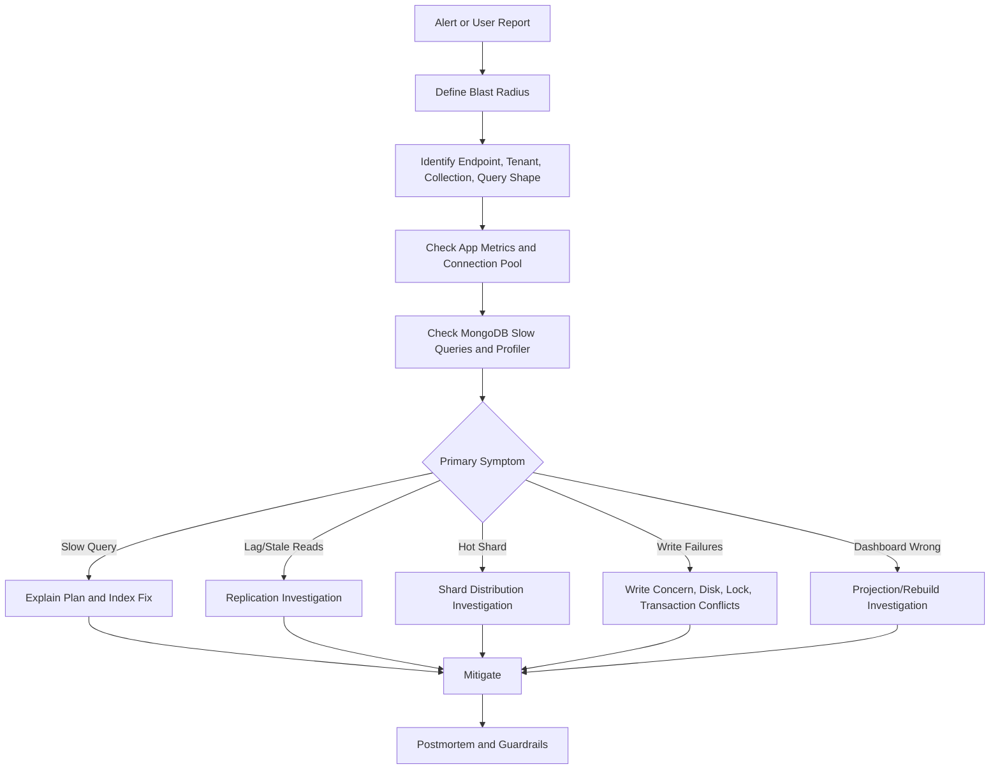
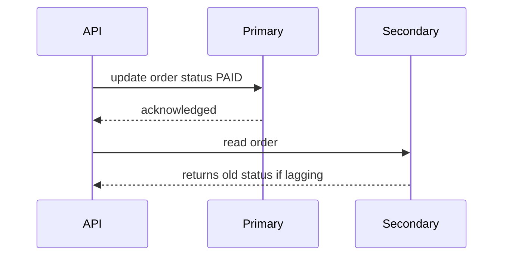
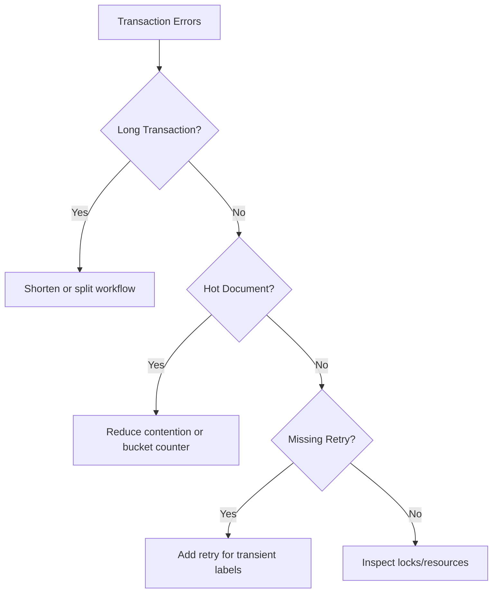
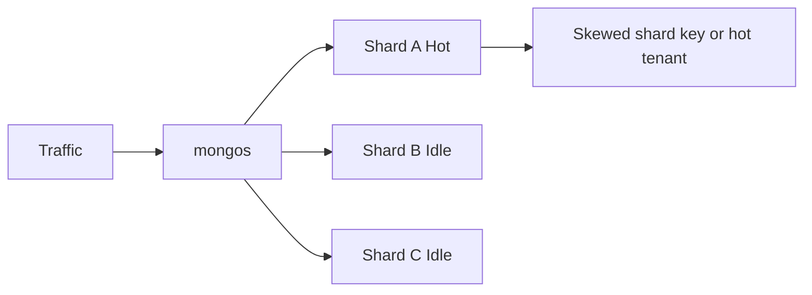
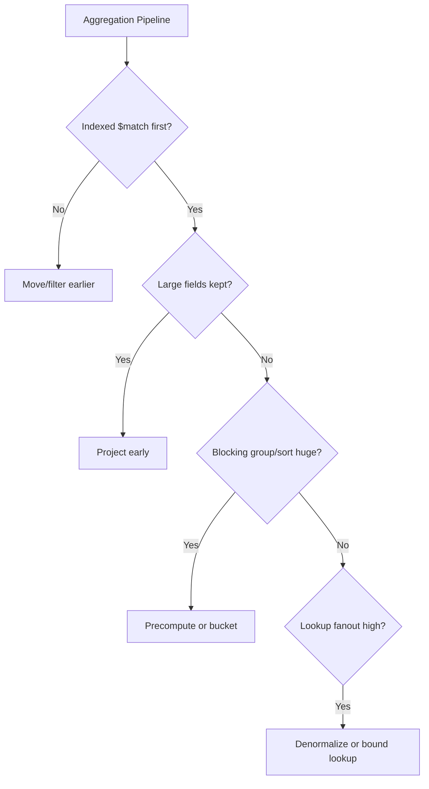
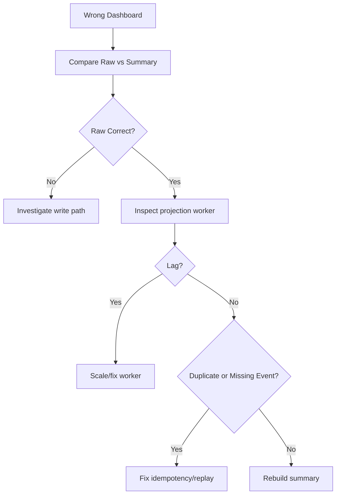
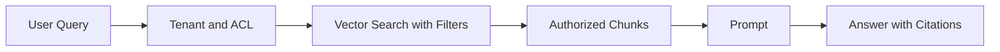

# MAANG MongoDB Production Incident Playbook

This playbook turns MongoDB troubleshooting into an interview-ready incident response framework. Use it when asked to debug slow queries, replication lag, hot shards, transaction conflicts, stale reads, connection pool saturation, or broken dashboards.

The goal is not to memorize commands. The goal is to show structured production judgment: isolate blast radius, identify the bottleneck, apply a reversible mitigation, then fix the root cause.

---

## 1. Universal Incident Flow



### Interview Answer Template

1. I first bound the incident by endpoint, tenant, collection, region, and time window.
2. I compare application latency with MongoDB metrics to avoid blaming the database too early.
3. I capture the exact query or write shape.
4. I inspect explain plans, slow logs, current operations, replication lag, and resource saturation.
5. I apply the least risky mitigation first.
6. I follow up with a root-cause fix, tests, alerting, and capacity guardrails.

---

## 2. Slow Query Incident

### Interview Prompt

An endpoint returns 20 records but p99 jumped from 80 ms to 4 seconds. How do you debug it?

### Expected Answer

I capture the query shape, run `explain('executionStats')`, and inspect `nReturned`, `totalKeysExamined`, `totalDocsExamined`, `winningPlan`, and blocking sort. If the query scans millions of docs to return 20 rows, the index is missing, wrong, or not selective enough. If the plan changed after data growth, I validate whether a compound index matching filter and sort is needed.

### Commands

```javascript
db.orders.find({ tenantId: 't1', status: 'PAID' })
  .sort({ createdAt: -1 })
  .limit(20)
  .explain('executionStats')

db.setProfilingLevel(1, { slowms: 100 })
db.system.profile.find({ ns: /orders/ }).sort({ ts: -1 }).limit(5)
```

### Diagnosis Table

| Signal | Meaning | Action |
|---|---|---|
| `COLLSCAN` | no usable index | create or fix index |
| `SORT` stage | sort not satisfied by index | include sort field in compound index |
| high `docsExamined` | low selectivity or fetch-heavy plan | improve prefix/selectivity/projection |
| high `keysExamined` | index scans too much | reorder or narrow index |
| low DB time, high app time | app/pool/network bottleneck | inspect pool and downstream calls |

### Strong Mitigation

If the index build is large, I assess production-safe index build options, expected resource impact, and rollback plan. For immediate mitigation, I can reduce query fanout, add temporary limits, disable expensive filters, or route heavy reporting to a read model.

---

## 3. Index Regression Incident

### Interview Prompt

A deployment made reads slower even though no database version changed. What could have happened?

### Expected Answer

The application may have changed query shape: added a sort, changed a filter type, removed tenant filter, changed collation, added regex, changed projection, or introduced `$or`. Existing indexes may no longer match. I compare old and new query shapes and explain plans.

### Common Regressions

| Change | Why It Hurts |
|---|---|
| new sort field | compound index no longer satisfies sort |
| missing `tenantId` | scans cross-tenant data |
| regex prefix removed | index cannot be used effectively |
| field type changed | index entries do not match expected predicate |
| `$or` added | each branch needs usable index |
| collation changed | index collation mismatch |

### Guardrails

- Add query shape tests for critical repositories.
- Store expected explain snapshots for hot queries.
- Monitor `docsExamined / nReturned` ratio.
- Review every new index against write cost.

---

## 4. Replication Lag Incident

### Interview Prompt

Users report stale order status after payment succeeds. What do you check?

### Expected Answer

I check whether reads are going to secondaries and whether replication lag increased. The primary may acknowledge writes before secondaries apply them depending on write concern and read path. For read-your-write flows, I read from primary or use causal consistency. For analytics, secondary reads can tolerate bounded staleness.



### Commands

```javascript
rs.status()
db.serverStatus().opcounters
db.currentOp({ active: true })
```

### Causes

| Cause | Symptom | Mitigation |
|---|---|---|
| secondary disk pressure | lag grows | scale storage, reduce workload |
| network issue | secondaries fall behind | fix network/region path |
| large index build | replication delayed | schedule/monitor builds |
| primary overloaded | writes slow and lag grows | reduce load, scale, optimize writes |
| read preference secondary | stale reads | use primary for critical flow |

---

## 5. Write Concern and Rollback Risk

### Interview Prompt

Why can weak write concern be dangerous during failover?

### Expected Answer

If a write is acknowledged before being replicated to a majority, a primary can fail before secondaries persist that write. A new primary may be elected without it, causing rollback. For critical business state, use majority write concern and retryable writes. The cost is higher latency.

### Tradeoff

| Write Concern | Benefit | Risk |
|---|---|---|
| `w: 1` | low latency | rollback risk on failover |
| `w: majority` | durable across majority | higher latency |
| journaled writes | better local durability | still not cross-node majority |

### Interview Line

Write concern is a business durability choice, not just a database setting.

---

## 6. Transaction Conflict Incident

### Interview Prompt

Checkout started failing with transient transaction errors after traffic increased. What do you do?

### Expected Answer

I check transaction duration, number of documents touched, conflict hotspots, retry logic, and whether the transaction is necessary. Long or broad transactions increase conflict probability. If the workflow can be redesigned around single-document atomic updates, conditional writes, or sagas, that is usually better.



### Mitigations

- Keep transactions short.
- Touch fewer documents.
- Add retry logic for transient transaction errors.
- Avoid user/network calls inside transactions.
- Replace high-contention counters with buckets or async aggregation.
- Use single-document conditional updates where possible.

---

## 7. Hot Partition or Hot Shard Incident

### Interview Prompt

One shard is at 90% CPU while others are idle. How do you debug it?

### Expected Answer

I inspect shard key distribution, chunk distribution, balancer status, jumbo chunks, tenant skew, and whether traffic targets a small key range. Monotonic shard keys and tenantId-only keys are common causes.

### Diagnosis Matrix

| Symptom | Likely Cause | Fix |
|---|---|---|
| newest chunk hot | timestamp shard key | reshard/bucket/hash suffix |
| one tenant hot | tenantId-only key | isolate tenant or compound key |
| chunks cannot move | jumbo chunks | reduce chunk size/design key better |
| queries scatter | shard key absent from query | change query/index or key strategy |
| writes target one range | monotonic inserts | add distribution component |

### Diagram



### Mitigation Order

1. Reduce immediate traffic or move heavy tenant workload if possible.
2. Confirm whether balancer can help.
3. Add read/write throttling for offending tenant or route.
4. Plan resharding or tenant isolation.
5. Redesign key if the access pattern fundamentally conflicts.

---

## 8. Aggregation Spill or Memory Incident

### Interview Prompt

A dashboard aggregation times out after data doubled. What happened?

### Expected Answer

The pipeline may be grouping, sorting, or looking up too much data. I check whether `$match` is early and indexed, whether large fields are projected out, whether `$sort` is index-backed, whether `$lookup` fanout exploded, and whether the dashboard should use precomputed summaries instead of raw aggregation.

### Pipeline Review



### Tradeoffs

| Fix | Benefit | Cost |
|---|---|---|
| `allowDiskUse` | avoids memory failure | slower and can stress disk |
| early `$match` | less data | needs good index |
| materialized summary | fast dashboard | eventual consistency |
| denormalization | avoids lookup | duplicate maintenance |
| OLAP export | better analytics | more architecture |

---

## 9. Connection Pool Saturation

### Interview Prompt

MongoDB CPU is fine, but API requests time out waiting for DB. What do you inspect?

### Expected Answer

I inspect driver connection pool metrics, max pool size, wait queue time, slow operations holding sockets, deployment concurrency, and whether the app creates too many clients. One MongoDB client per process should be reused. Pool increases are not a substitute for fixing slow queries.

### Symptoms

| Signal | Meaning |
|---|---|
| high wait queue time | pool exhausted |
| many app instances each with huge pool | connection storm |
| one slow query blocks many requests | pool starvation |
| client created per request | severe anti-pattern |

### Mitigation

- Reuse client singleton.
- Fix slow operations first.
- Tune pool size against app concurrency and server capacity.
- Add timeouts and backpressure.
- Avoid unbounded parallel DB calls per request.

---

## 10. Real-Time Dashboard Drift

### Interview Prompt

The dashboard count is wrong but raw orders are correct. How do you debug it?

### Expected Answer

I treat the summary as a projection. I check change-stream lag, worker errors, idempotency, duplicate processing, out-of-order updates, schema changes, and whether the summary can be rebuilt from raw data. A robust dashboard design always has a replay/backfill path.

### Debug Flow



### Guardrails

- Store projection checkpoint.
- Use idempotency keys.
- Keep raw source of truth long enough for replay.
- Add reconciliation jobs.
- Expose freshness timestamp on dashboard.

---

## 11. RAG Retrieval Incident

### Interview Prompt

The GenAI app returns answers from documents the user should not access. What failed?

### Expected Answer

The retrieval layer likely applied ACL filtering too late or inconsistently. Tenant and ACL filters must be part of retrieval, not only prompt construction. I check chunk metadata, source document ACL sync, embedding pipeline, vector index filters, and deleted source handling.



### Failure Modes

| Failure | Effect | Fix |
|---|---|---|
| ACL post-filter only | leaked candidates risk | pre-filter in retrieval |
| stale ACL metadata | revoked users see docs | sync/reindex ACL changes |
| source deletion not cascaded | deleted docs retrieved | delete chunks by source ID |
| model version mixed | retrieval quality drops | track embedding model version |
| no citations | hard to audit | return source references |

---

## 12. Postmortem Template

### What to Capture

| Section | Questions |
|---|---|
| Impact | Who was affected, for how long, and how badly? |
| Trigger | What changed: deploy, data growth, index, traffic, failover? |
| Detection | Which alert fired and which should have fired? |
| Root cause | What exact query, schema, shard, or infrastructure issue caused it? |
| Mitigation | What stopped the bleeding? |
| Prevention | What test, alert, dashboard, index, or design change prevents repeat? |

### Strong Interview Closing

The best production answer names both the immediate mitigation and the permanent design correction. For example, adding an index may fix today's latency, but the long-term fix may be a bounded schema, a materialized dashboard, a better shard key, or tenant isolation.
