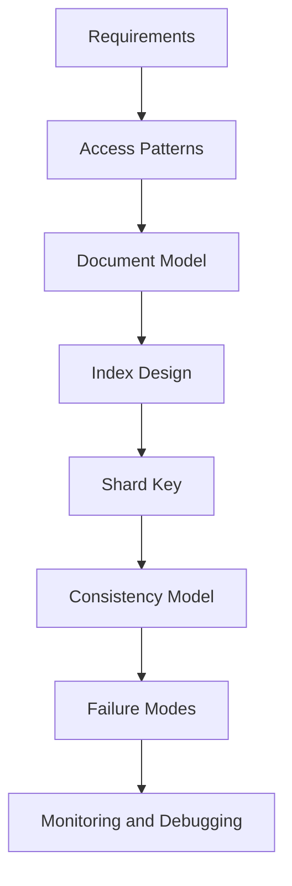
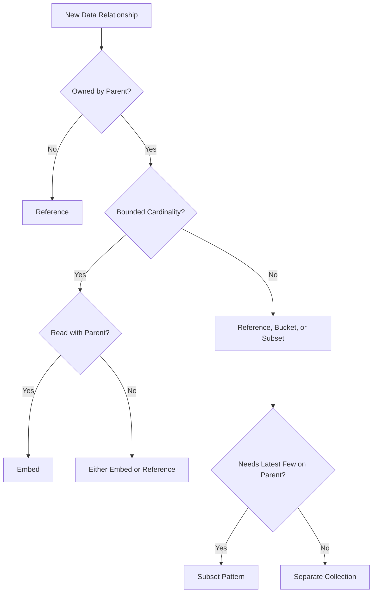
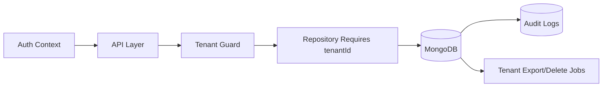
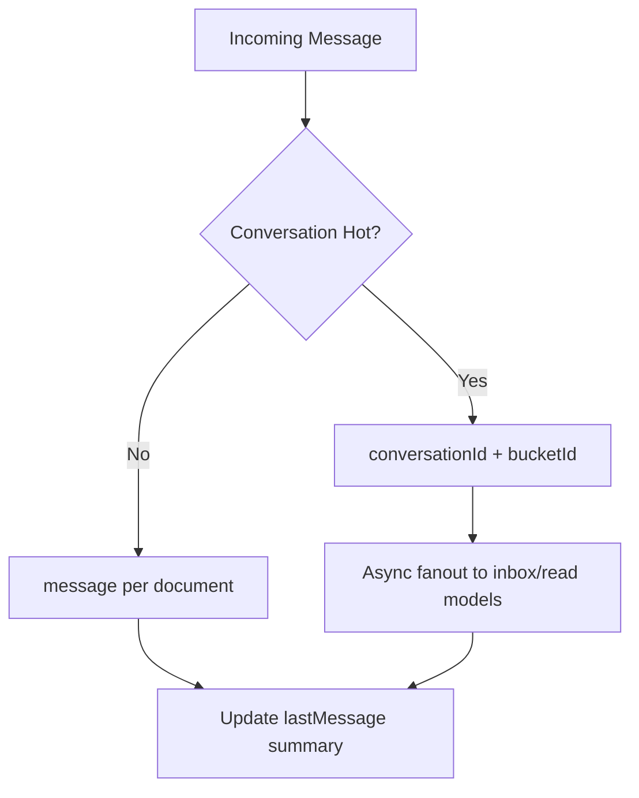
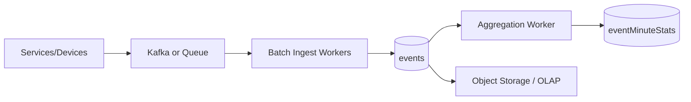
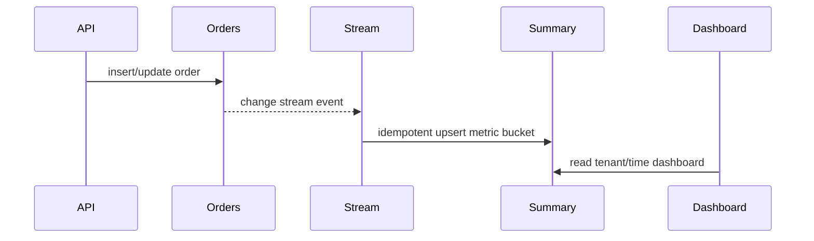
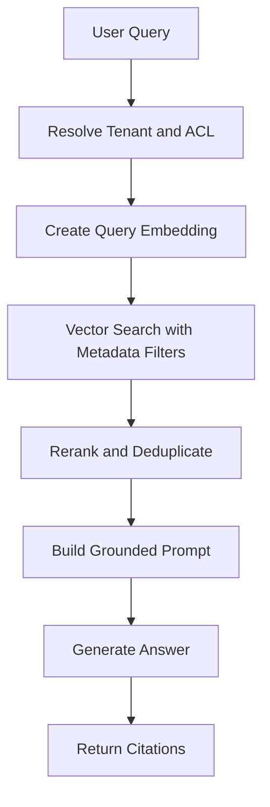

# MAANG MongoDB Architecture Playbook

This playbook is for backend and system design rounds where the interviewer expects you to defend MongoDB under scale. It connects schema design, shard keys, indexes, aggregation, consistency, and production failure handling into repeatable design patterns.

Use this sequence in interviews:

1. Clarify product and workload.
2. Identify access patterns and write volume.
3. Design documents around aggregate boundaries.
4. Pick indexes and shard keys from query shapes.
5. State consistency and failure tradeoffs.
6. Explain how you debug and operate the design.

---

## 1. Interview Design Framework

### The Five Questions

| Question | Why It Matters | Example |
|---|---|---|
| What is read together? | drives embedding | order with line items |
| What grows without bound? | drives referencing or buckets | product reviews, chat messages |
| What must update atomically? | drives document boundary or transaction | cart total and cart items |
| What query shapes are hot? | drives indexes | tenant + status + createdAt |
| What creates skew? | drives shard key and tenant isolation | one enterprise tenant |

### Interview Diagram



### Strong Opening Answer

I would not start by mapping tables to collections. I would start from access patterns, aggregate boundaries, growth patterns, and consistency requirements. MongoDB works best when the hot path reads one or a few well-indexed documents and avoids distributed joins on every request.

---

## 2. Schema Design Tradeoff Matrix

| Pattern | Use When | Avoid When | Interview Trap |
|---|---|---|---|
| Embed | child is bounded, owned, read with parent | child is unbounded or shared | embedding product reviews forever |
| Reference | child is large, shared, independent | every read needs many joins | making MongoDB look like normalized SQL |
| Subset | parent needs latest N children | full child history is always needed | forgetting to reconcile subset with source |
| Bucket | time-series/chat/events need grouped writes | random updates inside bucket dominate | bucket too large or too hot |
| Computed | repeated reads need summary | source changes too often for cheap updates | no rebuild path |
| Outbox | reliable cross-service events | single-service local update only | no idempotency key |
| Extended Reference | avoid hot lookup for stable fields | referenced fields change constantly | stale duplicated fields surprise team |

### Decision Flow



---

## 3. Shard Key Selection Framework

### What a Good Shard Key Does

A shard key should distribute data and traffic while preserving targeted routing for common queries. A key with high cardinality but poor query targeting can still be expensive. A key with good locality but skewed traffic can create hot shards.

### Candidate Scorecard

| Criterion | Good Signal | Bad Signal |
|---|---|---|
| Cardinality | millions of values | only a few statuses/regions |
| Distribution | values spread evenly | one tenant dominates |
| Query targeting | hot queries include shard key | many scatter-gather reads |
| Write distribution | inserts spread across chunks | monotonic timestamp key |
| Stability | key never changes | business field can change |
| Compliance | supports region/tenant isolation | data residency ignored |

### Shard Key Examples

| Workload | Candidate | Why |
|---|---|---|
| tenant order lookup | `{ tenantId: 1, orderId: 1 }` | targets tenant/order reads and spreads within tenant |
| chat messages | `{ conversationId: 1, bucketId: 1 }` | keeps conversation ranges while avoiding one endless range |
| event ingestion | `{ tenantId: 1, bucketId: 1, eventId: 1 }` | balances tenant routing and write spread |
| IoT metrics | `{ deviceId: 'hashed' }` plus time index | spreads device writes if queries are device-scoped |
| RAG chunks | `{ tenantId: 1, sourceDocumentId: 1 }` | targets source management and tenant isolation |

### Anti-Patterns

- `{ createdAt: 1 }` for heavy inserts because newest writes hit the same range.
- `{ status: 1 }` because cardinality is tiny.
- `{ tenantId: 1 }` when a few tenants are much larger than all others.
- Random hashed key when most queries need tenant or conversation locality.

---

## 4. Multi-Tenant SaaS Design

### Requirements

- Tenant isolation.
- Tenant-scoped uniqueness.
- Fast tenant dashboards.
- Enterprise tenant scale-out.
- Tenant export/delete.
- Auditability.

### Core Model

```javascript
// users
{
  tenantId: 't1',
  userId: 'u1',
  email: 'dev@example.com',
  roles: ['admin'],
  status: 'ACTIVE',
  createdAt: ISODate('2026-07-01T10:00:00Z')
}

// projects
{
  tenantId: 't1',
  projectId: 'p1',
  name: 'Payments Migration',
  members: [{ userId: 'u1', role: 'owner' }],
  updatedAt: ISODate('2026-07-01T10:00:00Z')
}
```

### Indexes

```javascript
db.users.createIndex({ tenantId: 1, email: 1 }, { unique: true })
db.projects.createIndex({ tenantId: 1, projectId: 1 }, { unique: true })
db.projects.createIndex({ tenantId: 1, updatedAt: -1 })
db.auditLogs.createIndex({ tenantId: 1, createdAt: -1 })
```

### Architecture



### Tradeoffs

| Choice | Benefit | Cost |
|---|---|---|
| shared database and collections | operationally simple | strongest app-level isolation needed |
| database per tenant | better isolation | many databases to operate |
| shard by tenant plus entity | scales large tenants better | more complex key design |
| dedicated cluster for enterprise tenant | isolation and noisy-neighbor control | cost and provisioning complexity |

### Failure Modes

- Missing `tenantId` filter causes data leak.
- Unique index without tenant prefix blocks same email across tenants.
- One enterprise tenant dominates shard or index cache.
- Tenant deletion leaves orphaned child documents.

---

## 5. Chat Message Storage

### Requirements

- Append messages quickly.
- Page recent messages backward.
- Support large group chats.
- Handle edits/deletes/reactions/read receipts.
- Survive duplicate client retries.

### Model

```javascript
// conversations
{
  tenantId: 't1',
  conversationId: 'c1',
  type: 'GROUP',
  participantIds: ['u1', 'u2'],
  lastMessage: {
    messageId: 'm9',
    senderId: 'u2',
    preview: 'ship it',
    createdAt: ISODate('2026-07-01T10:00:00Z')
  }
}

// messages
{
  tenantId: 't1',
  conversationId: 'c1',
  messageId: 'm10',
  clientMessageId: 'device-123-999',
  senderId: 'u1',
  body: 'Deploy finished',
  createdAt: ISODate('2026-07-01T10:00:01Z'),
  editedAt: null,
  deletedAt: null
}
```

### Indexes

```javascript
db.conversations.createIndex({ tenantId: 1, participantIds: 1, 'lastMessage.createdAt': -1 })
db.messages.createIndex({ tenantId: 1, conversationId: 1, createdAt: -1, _id: -1 })
db.messages.createIndex({ tenantId: 1, conversationId: 1, clientMessageId: 1 }, { unique: true })
```

### Pagination

Use cursor pagination, not deep `skip`.

```javascript
db.messages.find({
  tenantId: 't1',
  conversationId: 'c1',
  createdAt: { $lt: lastSeenCreatedAt }
}).sort({ createdAt: -1, _id: -1 }).limit(50)
```

### Hot Conversation Strategy



### Tradeoffs

| Design | Benefit | Cost |
|---|---|---|
| one message per document | simple, searchable, pageable | many docs and indexes |
| bucket messages | fewer docs, better compression | harder edits and pagination |
| embed latest message | fast inbox | duplicate update path |
| separate read receipts | avoids rewriting messages | extra collection/read model |

---

## 6. Audit Logging

### Requirements

- Append-only writes.
- Investigation queries by tenant, actor, target, and time.
- Retention and legal hold.
- High integrity and least privilege.

### Model

```javascript
{
  tenantId: 't1',
  auditId: 'a1',
  actor: { type: 'USER', id: 'u1' },
  action: 'ORDER_REFUNDED',
  target: { type: 'ORDER', id: 'o1' },
  request: { requestId: 'req-123', ip: '203.0.113.10' },
  metadata: { amountCents: 2500 },
  createdAt: ISODate('2026-07-01T10:00:00Z')
}
```

### Indexes

```javascript
db.auditLogs.createIndex({ tenantId: 1, createdAt: -1 })
db.auditLogs.createIndex({ tenantId: 1, 'actor.id': 1, createdAt: -1 })
db.auditLogs.createIndex({ tenantId: 1, 'target.type': 1, 'target.id': 1, createdAt: -1 })
```

### Tradeoffs

| Concern | MongoDB Choice | Caveat |
|---|---|---|
| retention | TTL or archive job | TTL is not precise legal deletion |
| integrity | append-only app role | true immutability may need WORM storage |
| investigation | compound indexes | index cost on high write volume |
| compliance | majority write concern | higher write latency |

---

## 7. Large-Scale Event Ingestion

### Requirements

- High write throughput.
- Idempotent ingestion.
- Query by tenant/time/type.
- Retention and rollups.
- Backpressure handling.

### Architecture



### Model

```javascript
{
  tenantId: 't1',
  eventId: 'evt-001',
  eventType: 'PAYMENT_CAPTURED',
  entityId: 'pay-123',
  payload: { amountCents: 9900 },
  occurredAt: ISODate('2026-07-01T10:00:00Z'),
  ingestedAt: ISODate('2026-07-01T10:00:01Z')
}
```

### Index Strategy

Keep the hot collection lean.

```javascript
db.events.createIndex({ tenantId: 1, eventType: 1, occurredAt: -1 })
db.events.createIndex({ tenantId: 1, eventId: 1 }, { unique: true })
```

### Tradeoffs

| Choice | Benefit | Cost |
|---|---|---|
| batch inserts | high throughput | slightly higher end-to-end latency |
| minimal indexes | faster writes | fewer direct query options |
| rollup collections | fast dashboards | eventual consistency |
| Kafka before MongoDB | backpressure and replay | more infrastructure |
| MongoDB only | simpler stack | less resilient to spikes |

---

## 8. Real-Time Dashboard Design

### Requirements

- Low-latency dashboard reads.
- Fresh-enough metrics.
- Rebuildable summaries.
- Tenant and time filters.

### Design

Do not aggregate raw orders or events for every dashboard request. Write raw facts once and maintain summary collections.



### Summary Document

```javascript
{
  tenantId: 't1',
  bucket: ISODate('2026-07-01T10:00:00Z'),
  granularity: 'minute',
  status: 'PAID',
  orderCount: 42,
  revenueCents: 120000,
  updatedAt: ISODate('2026-07-01T10:00:15Z')
}
```

### Interview Tradeoff

Real-time usually means bounded staleness, not raw-data aggregation on every refresh. State the freshness target, for example p95 dashboard freshness under 10 seconds.

---

## 9. RAG and GenAI Metadata Store

### Requirements

- Store chunks and lineage.
- Filter by tenant, ACL, document type, tags, and freshness.
- Support re-embedding.
- Support source deletion.
- Explain retrieval decisions.

### Model

```javascript
{
  tenantId: 't1',
  sourceDocumentId: 'doc-1',
  chunkId: 'doc-1:0007',
  text: 'Refunds are processed within 5 business days...',
  embedding: [0.012, -0.08, 0.44],
  embeddingModel: 'text-embedding-3-large',
  acl: { users: ['u1'], groups: ['support'] },
  metadata: { product: 'payments', tags: ['refunds'], page: 12 },
  contentHash: 'sha256:abc',
  createdAt: ISODate('2026-07-01T10:00:00Z')
}
```

### Retrieval Flow



### Tradeoffs

| Choice | Benefit | Cost |
|---|---|---|
| MongoDB vector + metadata | one operational store | less specialized than vector-only DBs |
| specialized vector DB | high-scale ANN tuning | metadata consistency integration |
| strict ACL filter before retrieval | safer | can reduce recall |
| post-filter ACL | simpler search | security risk if mishandled |
| embedding model version field | re-embedding control | extra lifecycle complexity |

---

## 10. MongoDB vs PostgreSQL in System Design

### Strong Comparison

MongoDB is a strong fit for aggregate-oriented, JSON-heavy, evolving schemas where hot reads match document boundaries. PostgreSQL is a strong fit for relational integrity, complex joins, constraints, ad hoc SQL analytics, and financial correctness.

| Requirement | Prefer MongoDB | Prefer PostgreSQL |
|---|---|---|
| product catalog with flexible attributes | yes | possible but less natural |
| financial ledger | rarely primary | yes |
| user profile document | yes | also fine |
| normalized reporting | use read model/OLAP | yes |
| strict foreign-key constraints | app-level | yes |
| multi-document transaction core | possible, use carefully | core strength |
| schema evolution speed | strong | migrations required |

### Interview Answer Pattern

I would not frame MongoDB as better than PostgreSQL. I would frame it as better for certain data shapes and access patterns. If the system needs rich relational constraints and ad hoc reporting, PostgreSQL is likely safer. If the system needs high-scale aggregate reads over flexible nested documents, MongoDB can reduce application join complexity.

---

## 11. Production Readiness Checklist

- Every hot query has an expected index and explain plan.
- Every collection has document growth boundaries.
- Every tenant query includes tenant isolation.
- Every high-write collection has an index budget.
- Every dashboard has a summary or cache strategy.
- Every cross-document invariant names transaction vs saga.
- Every sharded collection has a justified shard key.
- Every backup has a restore drill.
- Every incident has slow query, replication, connection pool, and resource metrics.
