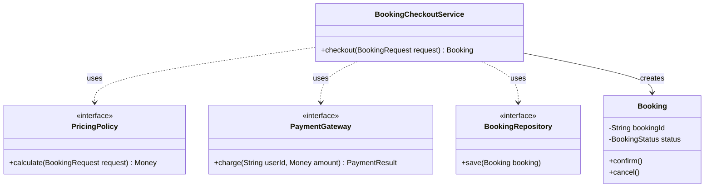
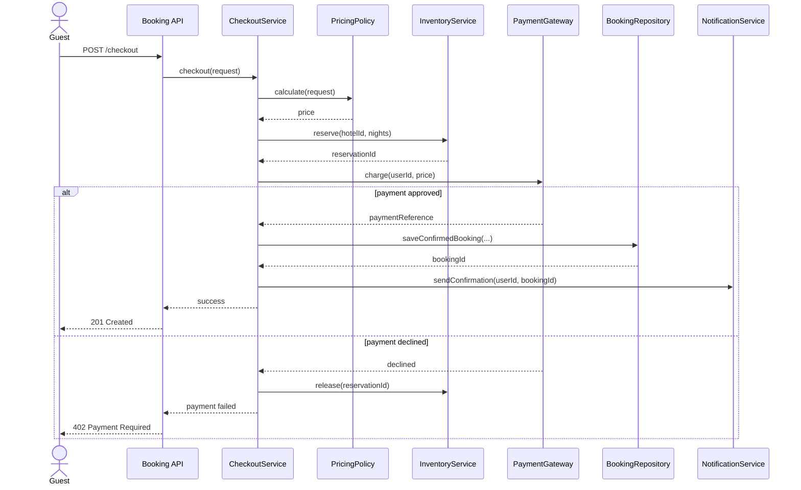
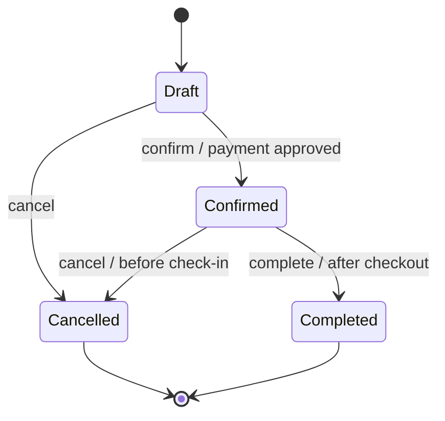
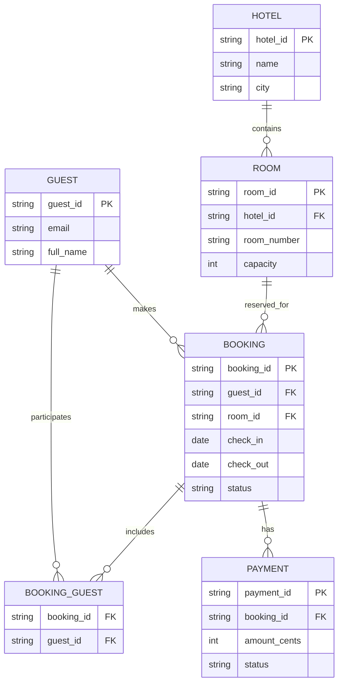

# UML and Modeling - Mentorship Track

> Goal: make UML and modeling practical for LLD interviews by connecting every diagram to code, responsibilities, runtime behavior, state transitions, and database structure.

---

## How We Will Use This Sheet

- We will keep this sheet focused on `2.3 UML & Modeling`.
- We will treat diagrams as thinking tools, not decoration.
- Every diagram type will be tied back to Java and Python code.
- We will use examples from a hotel booking system so the models connect to one consistent domain.
- We will show what each diagram clarifies and what it does not clarify.

---

## Roadmap for This Sheet

1. Class diagrams
2. Sequence diagrams
3. State diagrams
4. Entity-relationship modeling

---

## Modeling Decision Map

| If you need to understand... | Use... | Main question answered |
|---|---|---|
| Objects, responsibilities, fields, methods, inheritance, composition | Class diagram | What are the main classes and how are they related? |
| Runtime call flow between objects or services | Sequence diagram | Who calls whom, in what order, and what happens on failure? |
| Object lifecycle and valid transitions | State diagram | What states exist, and which transitions are allowed? |
| Database entities, primary keys, foreign keys, and cardinality | ER model | What data is stored, and how do records relate? |

---

## Confusion Map

| Common confusion | Clear distinction |
|---|---|
| Class diagram vs ER diagram | Class diagram models code objects and behavior. ER diagram models persisted data and relationships. |
| Class diagram vs sequence diagram | Class diagram is static structure. Sequence diagram is runtime interaction over time. |
| State diagram vs State pattern | State diagram is a model of lifecycle rules. State pattern is one possible code implementation. |
| Association vs dependency | Association is a structural relationship. Dependency means one class temporarily uses another. |
| Aggregation vs composition | Aggregation means has-a but independent lifetime. Composition means owned lifetime. |
| One-to-many vs many-to-many | One-to-many usually uses one foreign key. Many-to-many usually needs a join table. |
| Diagram completeness vs usefulness | A useful diagram shows the decision-relevant parts, not every field and method. |

---

## Diagram and Code Convention

- Mermaid diagrams are used because they are readable inside Markdown.
- Section 14 uses Java to show how the model maps to enterprise-style code.
- Section 15 uses Python to show a compact runnable version of the same idea.
- Comments marked `UML concept` show the exact modeling idea being applied.
- Diagrams should be small enough to explain in an interview without scrolling forever.

---

# Topic 1: Class Diagrams

> Track: 2.3 UML & Modeling
> Scope: classes, attributes, methods, associations, dependencies, inheritance, composition, multiplicity, and code mapping

---

## 1. Intuition

Think of a class diagram as the blueprint of a hotel booking service.

It tells you:
- what the important objects are
- what each object owns
- which objects know about each other
- where behavior belongs
- where extension points exist

It does not show the exact runtime order of calls. That is a sequence diagram.

Short memory trick:
- class diagram answers: "What are the building blocks and relationships?"

---

## 2. Definition

- Definition: A class diagram is a static structural UML diagram that shows classes, fields, methods, and relationships between types.
- Category: UML structural modeling
- Core idea: Show the shape of the code before or while implementing it.

Class diagrams commonly show:
- class name
- attributes
- operations
- association
- inheritance
- interface implementation
- composition
- multiplicity

---

## 3. Why It Exists

LLD interviews often fail when candidates jump into code too quickly.

Without a class diagram, common issues appear:
- responsibilities are unclear
- services become god classes
- entities know too much
- relationships are guessed while coding
- extension points are discovered too late

Class diagrams exist to slow the design down just enough to place responsibilities correctly.

They help you answer:
- should this be a field or method?
- should this be an interface?
- is this composition or inheritance?
- who owns this lifecycle?
- what does this service depend on?

---

## 4. Reality

In real teams, class diagrams are useful when:

- designing a new module
- reviewing a complex refactor
- explaining domain boundaries
- onboarding engineers
- documenting SDK contracts
- clarifying aggregate roots in domain-driven design
- preparing LLD interview answers

Production teams rarely maintain giant perfect UML diagrams. They usually keep small diagrams for important boundaries.

Interview maturity:
- draw only the key classes
- show relationships clearly
- then map diagram to code

---

## 5. How It Works

Step-by-step approach:

1. Identify nouns in the requirements.
2. Keep domain nouns that have state or behavior.
3. Identify services that coordinate use cases.
4. Identify interfaces for replaceable behavior.
5. Draw relationships with multiplicity.
6. Add only important fields and methods.
7. Check whether responsibilities are cohesive.

Example class diagram for checkout:



Diagram reading:
- `Booking` owns booking lifecycle state.
- `BookingCheckoutService` coordinates the checkout use case.
- `PricingPolicy`, `PaymentGateway`, and `BookingRepository` are replaceable collaborators.
- Dotted dependency arrows show use without ownership.

---

## 6. What Problem It Solves

- Primary problem solved: unclear static structure of the code.
- Secondary benefits: responsibility clarity, better naming, cleaner dependency boundaries.
- Systems impact: reduces accidental coupling before implementation spreads it everywhere.

Class diagrams are especially helpful for:
- entity design
- service responsibility boundaries
- design pattern explanation
- aggregate modeling
- LLD interview communication

---

## 7. When to Rely on It

Use a class diagram when:

- the design has 4 or more important classes
- responsibilities are unclear
- relationships matter
- you need to explain composition vs inheritance
- extension points matter
- interview asks for LLD class design

Interviewer keywords:
- design classes
- identify entities
- define relationships
- extensible design
- model the domain
- avoid god class

---

## 8. When Not to Use It

Avoid class diagrams when:

- the code is a tiny script
- the design is mostly procedural data transformation
- the diagram would just mirror every line of code
- the problem is runtime ordering, which needs sequence diagram
- the problem is database cardinality, which needs ER model

Use a simple list of responsibilities when a diagram would be heavier than the design.

---

## 9. Pros and Cons

| Pros | Cons |
|---|---|
| Clarifies static design | Can become stale if too detailed |
| Helps place responsibilities | Can be overdrawn with every field |
| Shows dependencies and extension points | Does not show runtime ordering |
| Great for LLD communication | Ambiguous arrows can confuse if not explained |

---

## 10. Trade-offs and Common Mistakes

### Trade-offs

- Gain: strong structural clarity before coding.
- Give up: time spent modeling instead of coding immediately.
- Complexity impact: reduces design confusion but can create documentation overhead.
- Interview impact: helps interviewer see your thinking quickly.

### Common Mistakes

- Mistake: drawing every DTO, enum, and helper.
- Why it is wrong: important relationships get buried.
- Better approach: show only decision-relevant classes.

- Mistake: using inheritance because the diagram looks neat.
- Why it is wrong: inheritance creates tight coupling.
- Better approach: prefer composition or interfaces unless true subtype behavior exists.

- Mistake: drawing service methods but no domain behavior.
- Why it is wrong: domain becomes anemic and services become too large.
- Better approach: put lifecycle methods on domain objects where appropriate.

---

## 11. Key Numbers

Modeling heuristics:

- 3 to 7 classes is a good interview diagram size.
- More than 10 classes usually needs grouping or a smaller scope.
- A class with more than 7 to 10 public methods may have too many responsibilities.
- A service depending on more than 5 collaborators may need review.
- A diagram older than the code should be treated as a conversation starter, not truth.

Memory number:
- In interviews, draw enough classes to explain the design, not enough to document the whole application.

---

## 12. Failure Modes

- Diagram lies: code changed but diagram did not.
- Over-modeling: candidate spends too long drawing and not designing behavior.
- Wrong relationship: composition drawn where dependency is enough.
- Missing multiplicity: relationship meaning becomes unclear.
- God service: diagram shows one service connected to everything.

Mitigations:
- keep diagrams scoped
- explain arrows verbally
- update diagrams only for stable design boundaries
- pair diagram with code-level examples

---

## 13. Scenario

- Product / system: Hotel checkout LLD
- Requirement: model booking, pricing, payment, and persistence without making checkout a god class
- Good design: class diagram separates domain entity, orchestration service, and replaceable interfaces
- Why this concept fits: relationships and responsibilities matter before code is written
- What would go wrong without it: checkout service would own pricing, payment, persistence, and lifecycle rules directly

---

## 14. Java Code Sample

### Class diagram mapped to Java code

```java
import java.math.BigDecimal;

record BookingRequest(String userId, String hotelId, int nights) {
}

record Money(BigDecimal amount, String currency) {
}

record PaymentResult(boolean approved, String reference) {
}

enum BookingStatus {
    DRAFT,
    CONFIRMED,
    CANCELLED
}

class Booking {
    private final String bookingId;
    private BookingStatus status = BookingStatus.DRAFT;

    Booking(String bookingId) {
        this.bookingId = bookingId;
    }

    public void confirm() {
        // UML concept: behavior belongs on the class that owns the lifecycle state.
        if (status != BookingStatus.DRAFT) {
            throw new IllegalStateException("only draft bookings can be confirmed");
        }
        status = BookingStatus.CONFIRMED;
    }

    public BookingStatus status() {
        return status;
    }
}

interface PricingPolicy {
    // UML concept: interface in the diagram becomes a replaceable Java contract.
    Money calculate(BookingRequest request);
}

interface PaymentGateway {
    PaymentResult charge(String userId, Money amount);
}

interface BookingRepository {
    void save(Booking booking);
}

class BookingCheckoutService {
    private final PricingPolicy pricingPolicy;
    private final PaymentGateway paymentGateway;
    private final BookingRepository bookingRepository;

    BookingCheckoutService(
            PricingPolicy pricingPolicy,
            PaymentGateway paymentGateway,
            BookingRepository bookingRepository) {
        // UML concept: dependency arrows become constructor-injected collaborators.
        this.pricingPolicy = pricingPolicy;
        this.paymentGateway = paymentGateway;
        this.bookingRepository = bookingRepository;
    }

    public Booking checkout(BookingRequest request) {
        Money price = pricingPolicy.calculate(request);
        PaymentResult payment = paymentGateway.charge(request.userId(), price);
        if (!payment.approved()) {
            throw new IllegalStateException("payment declined");
        }

        Booking booking = new Booking(payment.reference());
        booking.confirm();
        bookingRepository.save(booking);
        return booking;
    }
}
```

Key idea:
- the class diagram is useful only if it maps to responsibility boundaries in code

---

## 15. Python Mini Program / Simulation

This mini program shows the same class model in compact Python.

```python
from dataclasses import dataclass
from decimal import Decimal
from typing import Protocol


@dataclass(frozen=True)
class BookingRequest:
    user_id: str
    hotel_id: str
    nights: int


@dataclass(frozen=True)
class Money:
    amount: Decimal
    currency: str


class PricingPolicy(Protocol):
    # UML concept: protocol represents the interface box in the class diagram.
    def calculate(self, request: BookingRequest) -> Money:
        pass


class StandardPricing:
    def calculate(self, request: BookingRequest) -> Money:
        return Money(Decimal(request.nights * 150), "USD")


class Booking:
    def __init__(self, booking_id: str) -> None:
        self.booking_id = booking_id
        self.status = "draft"

    def confirm(self) -> None:
        # UML concept: method on the class models the domain operation.
        if self.status != "draft":
            raise ValueError("only draft bookings can be confirmed")
        self.status = "confirmed"


class CheckoutService:
    def __init__(self, pricing: PricingPolicy) -> None:
        # UML concept: association/dependency is represented as a collaborator field.
        self.pricing = pricing

    def checkout(self, request: BookingRequest) -> Booking:
        price = self.pricing.calculate(request)
        booking = Booking(f"booking-{price.amount}")
        booking.confirm()
        return booking


def main() -> None:
    service = CheckoutService(StandardPricing())
    booking = service.checkout(BookingRequest("user-1", "hotel-7", 2))
    print(booking.booking_id, booking.status)


if __name__ == "__main__":
    main()
```

What this demonstrates:
- classes in the diagram become code boundaries
- methods represent owned behavior
- dependencies become injected collaborators

---

## 16. Practical Question

> You are asked to design hotel checkout in an LLD interview. How would you use a class diagram before coding?

---

## 17. Strong Answer

I would use a class diagram to identify the core domain objects, orchestration services, and replaceable collaborators. For checkout, I would model `Booking` as the lifecycle owner, `BookingCheckoutService` as the use-case coordinator, and interfaces like `PricingPolicy`, `PaymentGateway`, and `BookingRepository` as dependencies.

I would show dependencies from checkout service to these interfaces, not concrete classes. That tells the interviewer the design is testable and extensible. Then I would map each box to code: domain state and behavior in `Booking`, orchestration in checkout service, and provider-specific behavior behind interfaces.

I would avoid drawing every helper class. The diagram should clarify ownership and relationships, not become a full code dump.

---

## 18. Revision Notes

- One-line summary: Class diagrams model static code structure and responsibility boundaries.
- Three keywords: classes, relationships, responsibilities
- One interview trap: drawing boxes without explaining ownership and dependencies.
- One memory trick: class diagram is the map of what exists; sequence diagram is the movie of what happens.

---

# Topic 2: Sequence Diagrams

> Track: 2.3 UML & Modeling
> Scope: runtime interactions, message order, synchronous calls, alternatives, failures, retries, and code flow mapping

---

## 1. Intuition

Think of a sequence diagram as the security camera footage of a hotel checkout.

It does not just say which objects exist. It shows what happens over time:
- guest requests checkout
- checkout service prices the booking
- inventory is reserved
- payment is charged
- booking is saved
- notification is sent

Short memory trick:
- sequence diagram answers: "Who talks to whom, in what order?"

---

## 2. Definition

- Definition: A sequence diagram is a UML interaction diagram that shows messages exchanged between participants over time.
- Category: UML behavioral modeling
- Core idea: Model runtime collaboration and call order.

Sequence diagrams commonly show:
- actors
- participants
- messages
- return values
- alternatives
- loops
- failure paths
- async calls

---

## 3. Why It Exists

Static diagrams do not show runtime flow.

Without a sequence diagram, teams often miss:
- wrong call ordering
- missing validation
- unclear retry behavior
- unclear failure ownership
- too many synchronous calls
- hidden coupling between services

Sequence diagrams exist to expose the flow before code hides it in method calls.

They help answer:
- should payment happen before saving booking?
- what happens if payment fails?
- who sends notification?
- is inventory released on failure?
- which calls are synchronous?

---

## 4. Reality

Sequence diagrams are common in:

- checkout flows
- payment workflows
- authentication flows
- OAuth flows
- distributed service interactions
- retry and compensation design
- onboarding flows
- API design reviews

In interviews, sequence diagrams are powerful because they show operational thinking, not only class names.

Strong signal:
- include a failure path, not only the happy path

---

## 5. How It Works

Step-by-step approach:

1. List the actor and participating services or objects.
2. Put them left to right from caller to downstream dependencies.
3. Draw the happy path first.
4. Add return values only when they matter.
5. Add `alt` blocks for failures or branches.
6. Add compensation when a later step fails.
7. Keep the diagram focused on one use case.

Example checkout sequence:



Diagram reading:
- checkout service owns orchestration
- payment failure triggers inventory release
- notification happens only after confirmed booking is saved
- API layer translates result to HTTP response

---

## 6. What Problem It Solves

- Primary problem solved: unclear runtime collaboration and call order.
- Secondary benefits: failure-path clarity, better API design, better orchestration boundaries.
- Systems impact: reduces bugs where code calls the right components in the wrong order.

Sequence diagrams are especially helpful for:
- workflows
- distributed calls
- retries
- compensation
- async vs sync decisions

---

## 7. When to Rely on It

Use a sequence diagram when:

- use case has multiple participants
- order matters
- failure behavior matters
- cross-service communication exists
- interviewer asks for API flow
- you need to explain retry, rollback, or compensation

Interviewer keywords:
- walk me through the flow
- what happens if payment fails
- service interaction
- request lifecycle
- sequence of calls
- failure path

---

## 8. When Not to Use It

Avoid sequence diagrams when:

- there is only one object doing simple work
- static structure is the question
- persistence relationships are the question
- diagram becomes too long to read
- every getter/setter call is shown

Use a class diagram for object structure.

Use an ER diagram for table relationships.

---

## 9. Pros and Cons

| Pros | Cons |
|---|---|
| Shows runtime order clearly | Can become unreadable for huge flows |
| Great for failure paths | Does not show full static class design |
| Exposes sync vs async coupling | Easy to overdraw low-level calls |
| Helps design compensation | Can become stale as workflow changes |

---

## 10. Trade-offs and Common Mistakes

### Trade-offs

- Gain: clear operational flow.
- Give up: compactness compared to a short paragraph.
- Complexity impact: makes complex flows visible, but can be too verbose.
- Interview impact: strong when you include happy path and failure path.

### Common Mistakes

- Mistake: showing only success path.
- Why it is wrong: real systems fail.
- Better approach: add at least one `alt` failure branch.

- Mistake: putting classes and methods that never interact at runtime.
- Why it is wrong: sequence diagrams are about messages over time.
- Better approach: show real participants in this use case.

- Mistake: drawing every internal method call.
- Why it is wrong: the important flow gets buried.
- Better approach: show boundary-level calls and key domain calls.

---

## 11. Key Numbers

Modeling heuristics:

- 5 to 8 participants is a good interview sequence diagram size.
- More than 10 participants often needs splitting.
- Include 1 happy path and at least 1 important failure path.
- A sequence diagram longer than 20 to 25 messages may need a higher-level version.
- If a request crosses 3 or more services, sequence modeling becomes valuable.

Memory number:
- Sequence diagram should explain the flow faster than reading the code.

---

## 12. Failure Modes

- Missing compensation: inventory stays reserved after payment failure.
- Wrong order: booking saved before payment approval.
- Hidden synchronous dependency: notification blocks checkout response.
- Unclear ownership: no participant owns rollback.
- Over-detailed diagram: key failure path is hard to find.

Mitigations:
- add `alt` failure branches
- label synchronous vs asynchronous calls when important
- include compensation messages
- keep one diagram per use case

---

## 13. Scenario

- Product / system: Hotel checkout workflow
- Requirement: calculate price, reserve inventory, charge payment, save booking, notify user, and release inventory if payment fails
- Good design: sequence diagram shows happy path and payment-declined path
- Why this concept fits: order and failure handling matter more than static class structure
- What would go wrong without it: implementation might save bookings before payment or forget inventory release

---

## 14. Java Code Sample

### Sequence diagram mapped to orchestration code

```java
record CheckoutRequest(String userId, String hotelId, int nights) {
}

record Money(int cents, String currency) {
}

record Reservation(String reservationId) {
}

record PaymentResult(boolean approved, String reference) {
}

interface PricingPolicy {
    Money calculate(CheckoutRequest request);
}

interface InventoryService {
    Reservation reserve(String hotelId, int nights);
    void release(String reservationId);
}

interface PaymentGateway {
    PaymentResult charge(String userId, Money money);
}

interface BookingRepository {
    String saveConfirmedBooking(CheckoutRequest request, String paymentReference);
}

interface NotificationService {
    void sendConfirmation(String userId, String bookingId);
}

class CheckoutService {
    private final PricingPolicy pricingPolicy;
    private final InventoryService inventoryService;
    private final PaymentGateway paymentGateway;
    private final BookingRepository bookingRepository;
    private final NotificationService notificationService;

    CheckoutService(
            PricingPolicy pricingPolicy,
            InventoryService inventoryService,
            PaymentGateway paymentGateway,
            BookingRepository bookingRepository,
            NotificationService notificationService) {
        this.pricingPolicy = pricingPolicy;
        this.inventoryService = inventoryService;
        this.paymentGateway = paymentGateway;
        this.bookingRepository = bookingRepository;
        this.notificationService = notificationService;
    }

    public String checkout(CheckoutRequest request) {
        // UML concept: each statement maps to a message in the sequence diagram.
        Money price = pricingPolicy.calculate(request);
        Reservation reservation = inventoryService.reserve(request.hotelId(), request.nights());
        PaymentResult payment = paymentGateway.charge(request.userId(), price);

        if (!payment.approved()) {
            // UML concept: failure branch from the sequence diagram becomes explicit compensation code.
            inventoryService.release(reservation.reservationId());
            throw new IllegalStateException("payment declined");
        }

        String bookingId = bookingRepository.saveConfirmedBooking(request, payment.reference());
        notificationService.sendConfirmation(request.userId(), bookingId);
        return bookingId;
    }
}
```

Key idea:
- the sequence diagram becomes the checklist for orchestration code and failure handling

---

## 15. Python Mini Program / Simulation

This mini program prints a trace that mirrors the sequence diagram.

```python
from dataclasses import dataclass


@dataclass(frozen=True)
class CheckoutRequest:
    user_id: str
    hotel_id: str
    nights: int


class Trace:
    def __init__(self) -> None:
        self.events: list[str] = []

    def add(self, event: str) -> None:
        self.events.append(event)


class CheckoutService:
    def __init__(self, trace: Trace) -> None:
        self.trace = trace

    def checkout(self, request: CheckoutRequest, approve_payment: bool) -> str:
        # UML concept: trace records the same ordered messages as a sequence diagram.
        self.trace.add("Checkout -> Pricing: calculate")
        price = request.nights * 150

        self.trace.add("Checkout -> Inventory: reserve")
        reservation_id = "reservation-1"

        self.trace.add("Checkout -> Payment: charge")
        if not approve_payment:
            # UML concept: alt failure branch is represented as explicit control flow.
            self.trace.add("Checkout -> Inventory: release")
            raise ValueError("payment declined")

        self.trace.add("Checkout -> Repository: saveConfirmedBooking")
        booking_id = f"booking-{price}-{reservation_id}"

        self.trace.add("Checkout -> Notification: sendConfirmation")
        return booking_id


def main() -> None:
    trace = Trace()
    service = CheckoutService(trace)
    try:
        print(service.checkout(CheckoutRequest("user-1", "hotel-7", 2), approve_payment=True))
    finally:
        for event in trace.events:
            print(event)


if __name__ == "__main__":
    main()
```

What this demonstrates:
- sequence diagrams map naturally to ordered orchestration code
- failure branches become explicit control flow
- trace output helps debug whether implementation follows the intended flow

---

## 16. Practical Question

> In a hotel checkout design, how would you use a sequence diagram to explain payment failure handling?

---

## 17. Strong Answer

I would draw the actor, API, checkout service, pricing, inventory, payment, repository, and notification participants. First I would show the happy path: price calculation, inventory reservation, payment charge, booking save, and notification.

Then I would add an `alt` branch for payment declined. In that branch, checkout releases the inventory reservation and returns a payment failure response. This proves the design handles partial progress and does not leave rooms locked accidentally.

I would not show every internal helper method. The goal is to communicate participant order, boundary calls, and failure ownership.

---

## 18. Revision Notes

- One-line summary: Sequence diagrams model runtime messages and ordering.
- Three keywords: order, participants, failure path
- One interview trap: drawing only happy path.
- One memory trick: class diagram is structure; sequence diagram is timeline.

---

# Topic 3: State Diagrams

> Track: 2.3 UML & Modeling
> Scope: lifecycle states, valid transitions, invalid actions, guards, terminal states, and state-machine code mapping

---

## 1. Intuition

Think of a hotel booking as a journey.

It starts as draft. It may become confirmed. It may be cancelled. It may become completed after stay. But a cancelled booking should not become completed.

A state diagram is the lifecycle map.

Short memory trick:
- state diagram answers: "Where can this object go next?"

---

## 2. Definition

- Definition: A state diagram is a UML behavioral diagram that models states of an object and allowed transitions between those states.
- Category: UML behavioral modeling
- Core idea: Make lifecycle rules explicit before implementing transition logic.

State diagrams commonly show:
- initial state
- states
- transitions
- events
- guard conditions
- final states
- invalid transition behavior

---

## 3. Why It Exists

Lifecycle bugs are common because status fields look simple.

Bad examples:
- cancelled booking gets confirmed again
- completed booking gets cancelled with refund
- payment moves from failed to captured without authorization
- order skips required review state

State diagrams exist because a status field is not the same as a lifecycle model.

They help answer:
- what states exist?
- what event moves one state to another?
- which transitions are invalid?
- which states are terminal?
- do transitions require guards?

---

## 4. Reality

State diagrams are used for:

- booking lifecycle
- order lifecycle
- payment lifecycle
- refund lifecycle
- ticket workflow
- approval workflow
- connection state
- subscription lifecycle
- shipment tracking

Interview signal:
- if the object has statuses and rules, draw a state diagram before writing transition code

---

## 5. How It Works

Step-by-step approach:

1. Identify all statuses from requirements.
2. Mark initial and terminal states.
3. Identify events that trigger transitions.
4. Add guards where transition depends on conditions.
5. Mark invalid transitions explicitly in discussion.
6. Map the state diagram to code through enum validation, transition table, or State pattern.

Example booking state diagram:



Diagram reading:
- `Draft` is the initial state.
- `Cancelled` and `Completed` are terminal states.
- `Confirmed -> Cancelled` has a guard: before check-in.
- no arrow exists from `Cancelled` to `Confirmed`, so that transition is invalid.

---

## 6. What Problem It Solves

- Primary problem solved: unclear lifecycle and transition rules.
- Secondary benefits: fewer invalid status changes, clearer tests, better domain modeling.
- Systems impact: protects workflows where state correctness matters.

State diagrams are especially useful when:
- status changes are business-critical
- transitions have guards
- terminal states exist
- many methods check current status

---

## 7. When to Rely on It

Use a state diagram when:

- an object has 3 or more meaningful lifecycle states
- actions depend on current state
- invalid transitions are important
- business process has terminal states
- requirements mention workflow, approval, cancellation, completion, refund, or retry

Interviewer keywords:
- status transition
- lifecycle
- workflow
- invalid state
- state machine
- terminal state
- guard condition

---

## 8. When Not to Use It

Avoid state diagrams when:

- state is only display metadata
- there are only 2 simple values and no behavior difference
- transition rules are trivial
- the process is better modeled as a long-running workflow engine
- the diagram would hide important data relationships

Use enum validation for small stable lifecycle rules.

Use a workflow engine when transitions need timers, retries, human tasks, and distributed execution.

---

## 9. Pros and Cons

| Pros | Cons |
|---|---|
| Makes lifecycle rules explicit | Can be overkill for simple statuses |
| Great for invalid transition discussion | Does not show class responsibilities |
| Maps well to tests | Can grow complex with many states |
| Clarifies terminal states | Does not model data cardinality |

---

## 10. Trade-offs and Common Mistakes

### Trade-offs

- Gain: explicit lifecycle correctness.
- Give up: compactness when state count is large.
- Complexity impact: useful for important workflows, noisy for simple flags.
- Test impact: each arrow becomes a transition test candidate.

### Common Mistakes

- Mistake: implementing status as a public setter.
- Why it is wrong: callers can bypass lifecycle rules.
- Better approach: expose domain methods like `confirm`, `cancel`, and `complete`.

- Mistake: missing terminal states.
- Why it is wrong: cancelled objects may accidentally move again.
- Better approach: explicitly mark terminal states and reject transitions.

- Mistake: confusing state diagram with sequence diagram.
- Why it is wrong: state diagram shows allowed lifecycle changes, not participant call order.
- Better approach: use both for complex workflows.

---

## 11. Key Numbers

Modeling heuristics:

- 2 simple states: enum validation may be enough.
- 3 or more behavior-changing states: draw a state diagram.
- Every arrow should map to at least one allowed transition test.
- Every missing important arrow should map to an invalid transition test.
- More than 8 to 10 states: consider splitting by sub-workflow.

Memory number:
- State diagram value grows with the number of invalid transitions you need to prevent.

---

## 12. Failure Modes

- Invalid transition allowed: cancelled booking becomes confirmed.
- Valid transition missing: confirmed booking cannot complete.
- Guard missing: booking cancelled after check-in.
- Terminal state not enforced: completed booking gets modified.
- Persistence mismatch: stored status value does not map to code state.

Mitigations:
- write transition tests from the diagram
- keep transition logic inside domain methods
- avoid public status setters
- handle unknown persisted states safely

---

## 13. Scenario

- Product / system: Hotel booking lifecycle
- Requirement: draft bookings can confirm or cancel; confirmed bookings can cancel before check-in or complete after checkout; cancelled and completed are terminal
- Good design: state diagram drives domain transition methods and tests
- Why this concept fits: state correctness is a core business rule
- What would go wrong without it: invalid transitions would appear through scattered status updates

---

## 14. Java Code Sample

### State diagram mapped to transition rules

```java
import java.time.LocalDate;

enum BookingStatus {
    DRAFT,
    CONFIRMED,
    CANCELLED,
    COMPLETED
}

class Booking {
    private BookingStatus status = BookingStatus.DRAFT;
    private final LocalDate checkIn;
    private final LocalDate checkOut;

    Booking(LocalDate checkIn, LocalDate checkOut) {
        this.checkIn = checkIn;
        this.checkOut = checkOut;
    }

    public void confirm(boolean paymentApproved) {
        // UML concept: Draft -> Confirmed transition requires the payment-approved guard.
        if (status != BookingStatus.DRAFT || !paymentApproved) {
            throw new IllegalStateException("booking cannot be confirmed");
        }
        status = BookingStatus.CONFIRMED;
    }

    public void cancel(LocalDate today) {
        if (status == BookingStatus.DRAFT) {
            // UML concept: Draft -> Cancelled is an allowed transition.
            status = BookingStatus.CANCELLED;
            return;
        }
        if (status == BookingStatus.CONFIRMED && today.isBefore(checkIn)) {
            // UML concept: Confirmed -> Cancelled has a before-check-in guard.
            status = BookingStatus.CANCELLED;
            return;
        }
        throw new IllegalStateException("booking cannot be cancelled from " + status);
    }

    public void complete(LocalDate today) {
        // UML concept: Confirmed -> Completed requires the after-checkout guard.
        if (status != BookingStatus.CONFIRMED || today.isBefore(checkOut)) {
            throw new IllegalStateException("booking cannot be completed");
        }
        status = BookingStatus.COMPLETED;
    }

    public BookingStatus status() {
        return status;
    }
}
```

Key idea:
- every valid arrow in the state diagram becomes a guarded domain method path

---

## 15. Python Mini Program / Simulation

This mini program uses a transition table directly derived from a state diagram.

```python
from dataclasses import dataclass
from datetime import date


@dataclass(frozen=True)
class Transition:
    from_status: str
    event: str
    to_status: str


class BookingStateMachine:
    def __init__(self) -> None:
        # UML concept: each tuple represents one arrow in the state diagram.
        self.transitions = {
            ("draft", "confirm"): "confirmed",
            ("draft", "cancel"): "cancelled",
            ("confirmed", "cancel"): "cancelled",
            ("confirmed", "complete"): "completed",
        }

    def move(self, current_status: str, event: str) -> str:
        next_status = self.transitions.get((current_status, event))
        if next_status is None:
            # UML concept: missing arrow means invalid transition.
            raise ValueError(f"cannot {event} from {current_status}")
        return next_status


class Booking:
    def __init__(self, check_in: date, check_out: date) -> None:
        self.status = "draft"
        self.check_in = check_in
        self.check_out = check_out
        self.machine = BookingStateMachine()

    def confirm(self, payment_approved: bool) -> None:
        if not payment_approved:
            raise ValueError("payment not approved")
        self.status = self.machine.move(self.status, "confirm")

    def cancel(self, today: date) -> None:
        if self.status == "confirmed" and today >= self.check_in:
            raise ValueError("cannot cancel after check-in")
        self.status = self.machine.move(self.status, "cancel")


def main() -> None:
    booking = Booking(date(2026, 7, 1), date(2026, 7, 5))
    booking.confirm(payment_approved=True)
    booking.cancel(today=date(2026, 6, 20))
    print(booking.status)


if __name__ == "__main__":
    main()
```

What this demonstrates:
- state diagram arrows can become transition table entries
- missing arrows become invalid transitions
- guard conditions still belong in domain logic

---

## 16. Practical Question

> A booking can be draft, confirmed, cancelled, or completed. How would you model allowed transitions before coding?

---

## 17. Strong Answer

I would draw a state diagram with `Draft` as the initial state and `Cancelled` and `Completed` as terminal states. I would show `Draft -> Confirmed` on payment approval, `Draft -> Cancelled` on cancellation, `Confirmed -> Cancelled` only before check-in, and `Confirmed -> Completed` after checkout.

Then I would implement transition methods like `confirm`, `cancel`, and `complete` on the booking domain object. I would not expose a public `setStatus` because that bypasses the lifecycle model.

Each valid arrow becomes an allowed transition test, and important missing arrows become invalid transition tests.

---

## 18. Revision Notes

- One-line summary: State diagrams model lifecycle states and allowed transitions.
- Three keywords: lifecycle, transition, guard
- One interview trap: treating status as a public mutable field.
- One memory trick: state diagram is the rulebook for status movement.

---

# Topic 4: Entity-Relationship Modeling

> Track: 2.3 UML & Modeling
> Scope: entities, primary keys, foreign keys, cardinality, normalization, join tables, aggregate boundaries, and code/database mapping

---

## 1. Intuition

Think of ER modeling as the filing system of the hotel.

The hotel needs to store:
- guests
- hotels
- rooms
- bookings
- payments
- booking guests

An ER model tells you what records exist and how they connect.

Short memory trick:
- ER model answers: "What data is persisted and how is it related?"

---

## 2. Definition

- Definition: Entity-relationship modeling is a data modeling technique that represents persisted entities, attributes, keys, and relationships.
- Category: Data modeling and database design
- Core idea: Model data shape and cardinality before choosing tables, indexes, and constraints.

ER models commonly show:
- entities
- attributes
- primary keys
- foreign keys
- one-to-one relationships
- one-to-many relationships
- many-to-many relationships
- optional vs required relationships

---

## 3. Why It Exists

Code models and database models are related but not identical.

Without ER modeling, common data bugs appear:
- duplicate guests
- bookings without valid rooms
- payments not linked to bookings
- many-to-many relationships stored as comma-separated values
- missing foreign keys
- unclear ownership of records
- impossible reporting queries

ER modeling exists to make persisted data relationships explicit.

It helps answer:
- what is the primary key?
- who owns the foreign key?
- is this one-to-many or many-to-many?
- should this be embedded or normalized?
- what constraints protect correctness?

---

## 4. Reality

ER modeling appears in:

- relational database design
- API data model discussions
- reporting and analytics schema design
- event payload design
- ORM mapping
- migration planning
- interview database design sections

For LLD interviews, ER modeling is especially useful when the problem stores important state.

Example prompts:
- design hotel booking
- design food delivery orders
- design parking lot tickets
- design library management
- design payment workflow

---

## 5. How It Works

Step-by-step approach:

1. Identify persistent nouns.
2. Pick primary keys.
3. Identify required attributes.
4. Define cardinality: one-to-one, one-to-many, many-to-many.
5. Add foreign keys.
6. Resolve many-to-many with join tables.
7. Add constraints for business correctness.
8. Think about common queries and indexes.

Example ER diagram:



Diagram reading:
- one guest can make many bookings
- one hotel has many rooms
- one room can appear in many bookings over time
- one booking can have multiple payments, such as charge and refund
- many-to-many between booking and guests is represented by `BOOKING_GUEST`

Possible relational DDL:

```sql
CREATE TABLE guest (
    guest_id VARCHAR(64) PRIMARY KEY,
    email VARCHAR(255) NOT NULL UNIQUE,
    full_name VARCHAR(255) NOT NULL
);

CREATE TABLE hotel (
    hotel_id VARCHAR(64) PRIMARY KEY,
    name VARCHAR(255) NOT NULL,
    city VARCHAR(128) NOT NULL
);

CREATE TABLE room (
    room_id VARCHAR(64) PRIMARY KEY,
    hotel_id VARCHAR(64) NOT NULL REFERENCES hotel(hotel_id),
    room_number VARCHAR(32) NOT NULL,
    capacity INT NOT NULL,
    UNIQUE (hotel_id, room_number)
);

CREATE TABLE booking (
    booking_id VARCHAR(64) PRIMARY KEY,
    guest_id VARCHAR(64) NOT NULL REFERENCES guest(guest_id),
    room_id VARCHAR(64) NOT NULL REFERENCES room(room_id),
    check_in DATE NOT NULL,
    check_out DATE NOT NULL,
    status VARCHAR(32) NOT NULL,
    CHECK (check_out > check_in)
);

CREATE TABLE payment (
    payment_id VARCHAR(64) PRIMARY KEY,
    booking_id VARCHAR(64) NOT NULL REFERENCES booking(booking_id),
    amount_cents INT NOT NULL,
    status VARCHAR(32) NOT NULL
);
```

---

## 6. What Problem It Solves

- Primary problem solved: unclear persisted data relationships.
- Secondary benefits: constraint clarity, query planning, normalization, better schema evolution.
- Systems impact: prevents data integrity bugs that code alone may miss.

ER modeling is especially useful for:
- relational schemas
- reporting requirements
- transaction-heavy systems
- inventory systems
- booking, order, payment, and user-management domains

---

## 7. When to Rely on It

Use ER modeling when:

- data must be persisted
- relationships matter
- many-to-many relationships exist
- reporting queries matter
- referential integrity matters
- database schema design is part of the interview

Interviewer keywords:
- data model
- tables
- schema
- primary key
- foreign key
- cardinality
- normalization
- constraints

---

## 8. When Not to Use It

Avoid detailed ER modeling when:

- the task is pure in-memory object design
- data is schemaless and relationships are intentionally flexible
- the interview asks only for class design
- schema is trivial and not decision-relevant
- the main challenge is runtime flow, not persistence

Use document modeling when a document database is a better fit.

Use class diagrams when code structure is the focus.

---

## 9. Pros and Cons

| Pros | Cons |
|---|---|
| Clarifies persisted data relationships | Can over-focus on storage too early |
| Helps enforce integrity | Does not show runtime behavior |
| Great for query and constraint planning | Object model may not match exactly |
| Reveals many-to-many join needs | Schema can become too normalized for read-heavy use cases |

---

## 10. Trade-offs and Common Mistakes

### Trade-offs

- Gain: durable data correctness and query clarity.
- Give up: some speed of initial implementation.
- Complexity impact: normalized models improve integrity but may require joins.
- Performance impact: schema design affects indexes, query cost, and write complexity.

### Common Mistakes

- Mistake: modeling many-to-many as a comma-separated column.
- Why it is wrong: hard to query, validate, and index.
- Better approach: use a join table.

- Mistake: confusing object composition with database ownership.
- Why it is wrong: object lifetime and row relationship are related but not identical.
- Better approach: reason separately about code ownership and database cardinality.

- Mistake: no constraints because application code validates.
- Why it is wrong: bugs, scripts, and concurrent writes can bypass application checks.
- Better approach: use database constraints for core invariants.

---

## 11. Key Numbers

Modeling heuristics:

- One-to-many: foreign key usually lives on the many side.
- Many-to-many: use a join table.
- Unique natural identifiers like email often need a unique constraint, not necessarily the primary key.
- Date ranges need validation in code and often database constraints.
- High-read systems may denormalize selectively after a normalized baseline is understood.

Memory number:
- ER model correctness starts with cardinality.

---

## 12. Failure Modes

- Orphan rows: payment exists without booking.
- Duplicate business data: two guest rows for one email.
- Wrong cardinality: one booking supports only one guest when group bookings are required.
- Missing constraints: invalid checkout date stored.
- Over-normalization: every read needs many joins.
- Under-normalization: updates become inconsistent.

Mitigations:
- add foreign keys for core relationships
- add unique constraints for natural uniqueness
- model join tables for many-to-many
- index common query paths
- denormalize intentionally, not accidentally

---

## 13. Scenario

- Product / system: Hotel booking database
- Requirement: store guests, hotels, rooms, bookings, payments, and additional guests on a booking
- Good design: ER model defines cardinality, keys, foreign keys, and join table
- Why this concept fits: data integrity and relationships are central
- What would go wrong without it: bookings could point to missing rooms, payments could become orphaned, and group bookings would be hard to represent

---

## 14. Java Code Sample

### ER model mapped to domain objects

```java
import java.time.LocalDate;
import java.util.List;

record GuestId(String value) {
}

record RoomId(String value) {
}

record BookingId(String value) {
}

record Guest(GuestId guestId, String email, String fullName) {
}

record Room(RoomId roomId, String hotelId, String roomNumber, int capacity) {
}

enum BookingStatus {
    DRAFT,
    CONFIRMED,
    CANCELLED
}

class Booking {
    private final BookingId bookingId;
    private final GuestId primaryGuestId;
    private final RoomId roomId;
    private final LocalDate checkIn;
    private final LocalDate checkOut;
    private final List<GuestId> additionalGuestIds;
    private BookingStatus status;

    Booking(
            BookingId bookingId,
            GuestId primaryGuestId,
            RoomId roomId,
            LocalDate checkIn,
            LocalDate checkOut,
            List<GuestId> additionalGuestIds) {
        // UML concept: ER CHECK constraint should also appear as domain validation.
        if (!checkOut.isAfter(checkIn)) {
            throw new IllegalArgumentException("checkout must be after checkin");
        }
        this.bookingId = bookingId;
        this.primaryGuestId = primaryGuestId;
        this.roomId = roomId;
        this.checkIn = checkIn;
        this.checkOut = checkOut;
        // UML concept: join table BOOKING_GUEST maps to a collection of guest ids in code.
        this.additionalGuestIds = List.copyOf(additionalGuestIds);
        this.status = BookingStatus.DRAFT;
    }
}

record Payment(String paymentId, BookingId bookingId, int amountCents, String status) {
    Payment {
        // UML concept: payment carries bookingId because PAYMENT has a foreign key to BOOKING.
        if (amountCents <= 0) {
            throw new IllegalArgumentException("payment amount must be positive");
        }
    }
}
```

Key idea:
- ER entities become persisted records, while domain code still enforces important invariants before persistence

---

## 15. Python Mini Program / Simulation

This mini program simulates foreign-key and cardinality checks in memory.

```python
from dataclasses import dataclass
from datetime import date


@dataclass(frozen=True)
class Guest:
    guest_id: str
    email: str


@dataclass(frozen=True)
class Room:
    room_id: str
    hotel_id: str
    room_number: str


@dataclass(frozen=True)
class Booking:
    booking_id: str
    guest_id: str
    room_id: str
    check_in: date
    check_out: date


class BookingDatabase:
    def __init__(self) -> None:
        self.guests: dict[str, Guest] = {}
        self.rooms: dict[str, Room] = {}
        self.bookings: dict[str, Booking] = {}
        self.booking_guests: set[tuple[str, str]] = set()

    def add_guest(self, guest: Guest) -> None:
        if any(existing.email == guest.email for existing in self.guests.values()):
            raise ValueError("email must be unique")
        self.guests[guest.guest_id] = guest

    def add_room(self, room: Room) -> None:
        self.rooms[room.room_id] = room

    def add_booking(self, booking: Booking) -> None:
        # UML concept: foreign keys are enforced before creating the booking row.
        if booking.guest_id not in self.guests:
            raise ValueError("guest foreign key missing")
        if booking.room_id not in self.rooms:
            raise ValueError("room foreign key missing")
        if booking.check_out <= booking.check_in:
            raise ValueError("checkout must be after checkin")
        self.bookings[booking.booking_id] = booking

    def add_guest_to_booking(self, booking_id: str, guest_id: str) -> None:
        # UML concept: many-to-many relationship is represented through a join table set.
        if booking_id not in self.bookings or guest_id not in self.guests:
            raise ValueError("join table foreign key missing")
        self.booking_guests.add((booking_id, guest_id))


def main() -> None:
    db = BookingDatabase()
    db.add_guest(Guest("guest-1", "a@example.com"))
    db.add_guest(Guest("guest-2", "b@example.com"))
    db.add_room(Room("room-1", "hotel-7", "701"))
    db.add_booking(Booking("booking-1", "guest-1", "room-1", date(2026, 7, 1), date(2026, 7, 5)))
    db.add_guest_to_booking("booking-1", "guest-2")
    print(db.booking_guests)


if __name__ == "__main__":
    main()
```

What this demonstrates:
- ER cardinality maps to collection and reference rules
- foreign keys map to existence checks
- join tables map many-to-many relationships cleanly

---

## 16. Practical Question

> You are designing a hotel booking database. How would you model guests, rooms, bookings, payments, and group guests?

---

## 17. Strong Answer

I would start with an ER model. `Guest`, `Hotel`, `Room`, `Booking`, and `Payment` are core entities. `Guest` to `Booking` is one-to-many for the primary guest. `Hotel` to `Room` is one-to-many. `Room` to `Booking` is one-to-many over time. `Booking` to `Payment` can be one-to-many because a booking may have payment attempts, captures, or refunds.

For group guests, I would not store guest ids as a comma-separated column. I would create a `BookingGuest` join table because a booking can include multiple guests and a guest can appear in multiple bookings.

I would add foreign keys, unique constraints like guest email, a uniqueness constraint for hotel room numbers, and a date check for `check_out > check_in`. I would add indexes based on common queries such as bookings by guest, bookings by room and date, and payments by booking.

---

## 18. Revision Notes

- One-line summary: ER modeling defines persisted entities, keys, cardinality, and constraints.
- Three keywords: entities, keys, cardinality
- One interview trap: confusing object relationships with database relationships.
- One memory trick: ER diagram is the database truth map; class diagram is the code responsibility map.

---

## Final Interview Comparison Sheet

| Model | Best use | Programming mapping |
|---|---|---|
| Class diagram | Static code structure and relationships | Classes, interfaces, fields, methods, constructor dependencies |
| Sequence diagram | Runtime call order and failure paths | Orchestration methods, traces, compensation logic |
| State diagram | Lifecycle rules and valid transitions | Enums, transition tables, domain methods, State pattern |
| ER model | Persisted data relationships | Tables, primary keys, foreign keys, constraints, join tables |

---

## Fast Recall Rules

- If the question asks for classes and relationships, start with class diagram.
- If the question asks for flow or who calls whom, use sequence diagram.
- If the question asks for statuses or lifecycle, use state diagram.
- If the question asks for tables or data model, use ER modeling.
- Class diagrams map to code structure.
- Sequence diagrams map to method call order.
- State diagrams map to transition rules.
- ER diagrams map to database schema.
- In interviews, draw the smallest diagram that clarifies the design decision.