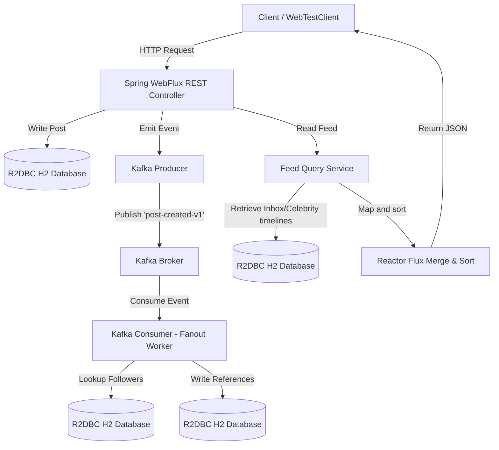

# Implementation Plan - Feed Architecture with Spring WebFlux & Kafka

We will build a high-performance, reactive REST API simulation demonstrating the three feed models (**Push**, **Pull**, and **Hybrid**) using **Java Spring Boot**, **Spring WebFlux**, and **Apache Kafka**. 

To simulate real-world horizontal scaling, the write-path fanout (Push and Hybrid models) will be decoupled asynchronously using Kafka event streams.

---

## Technical Architecture



---

## Proposed Stack & Infrastructure
* **Framework**: Spring Boot 3.3+ & Spring WebFlux (Reactor `Mono`/`Flux`)
* **Message Broker**: Apache Kafka (running in Docker via KRaft mode)
* **Database**: R2DBC (Reactive Relational Database Connectivity) with H2 (in-memory)
* **Build System**: Maven (with Wrapper `mvnw` for zero-install execution)

---

## Proposed Directory Structure

We will create this under `file:///C:/Users/aravi/Desktop/SystemDesign/july-2026/feed-system-simulation/`:

```text
feed-system-simulation/
│
├── docker-compose.yml            # Sets up local Apache Kafka broker
├── pom.xml                       # Maven build descriptor
├── mvnw / mvnw.cmd               # Maven wrappers for easy execution
│
└── src/main/java/com/systemdesign/feed/
    ├── FeedSystemApplication.java
    │
    ├── config/
    │   ├── KafkaConfig.java       # Topic definitions, producer/consumer config
    │   └── DatabaseConfig.java    # Schema initialization (R2DBC schema runner)
    │
    ├── model/
    │   ├── User.java              # id, username, isCelebrity
    │   ├── Post.java              # id, authorId, content, createdAt
    │   ├── Follow.java            # followerId, followedId
    │   ├── FeedInbox.java         # id, viewerId, postId, authorId, createdAt
    │   └── PostCreatedEvent.java  # Kafka message payload
    │
    ├── repository/                # Reactive R2DBC interfaces
    │   ├── UserRepository.java
    │   ├── PostRepository.java
    │   ├── FollowRepository.java
    │   └── FeedInboxRepository.java
    │
    ├── service/
    │   ├── FeedQueryService.java  # Implements Push, Pull, Hybrid read merging
    │   ├── FanoutService.java     # Handles writing into follower inboxes
    │   ├── MetricsTracker.java    # Tracks query counts & execution duration
    │   └── KafkaProducerService.java
    │
    └── controller/
        ├── UserController.java
        ├── PostController.java
        ├── FeedController.java
        └── SimulationController.java # Automatically seeds follow graphs & runs benchmark test
```

---

## API Endpoints

### 1. User Management
* **`POST /api/users`**: Create a user.
  ```json
  { "username": "celebrity_elon", "celebrity": true }
  ```

### 2. Follow Graph
* **`POST /api/follow`**: Connect users.
  ```json
  { "followerId": 1, "followedId": 2 }
  ```

### 3. Post Creation
* **`POST /api/posts`**: Create post. Writes to DB. If using Push/Hybrid, publishes a `PostCreatedEvent` to Kafka.
  ```json
  { "authorId": 2, "content": "Rocket launch success!" }
  ```

### 4. Feed Retrieval
* **`GET /api/users/{userId}/feed?strategy=PUSH|PULL|HYBRID`**:
  * Returns a reactive stream (`Flux<Post>`) representing the home feed.
  * Toggles distribution logic on the fly for head-to-head benchmarking.

### 5. Benchmark Simulation
* **`POST /api/simulate`**: Seeds a skewed database (e.g., 5 celebrities, 1000 normal users, 20,000 follow relationships), generates a burst of posts, and triggers random feed queries. Returns a statistical evaluation of:
  * Read Latency (p50, p95, p99)
  * Write Completion Latency (from posting to inbox delivery)
  * Storage Amplification (total records written to database)

---

## Verification Plan

### Automated Testing
* **Kafka Integration Test**: Spring Kafka integration verification (`@SpringBootTest`).
* **WebFlux Feed Verification**: End-to-end tests validating chronological correctness and celebrity pull-merging logic using `WebTestClient`.

### Manual Testing
1. Run `docker compose up -d` to start local Kafka.
2. Run `./mvnw spring-boot:run` to launch the reactive API.
3. Call `POST /api/simulate` and view the benchmarking logs.
